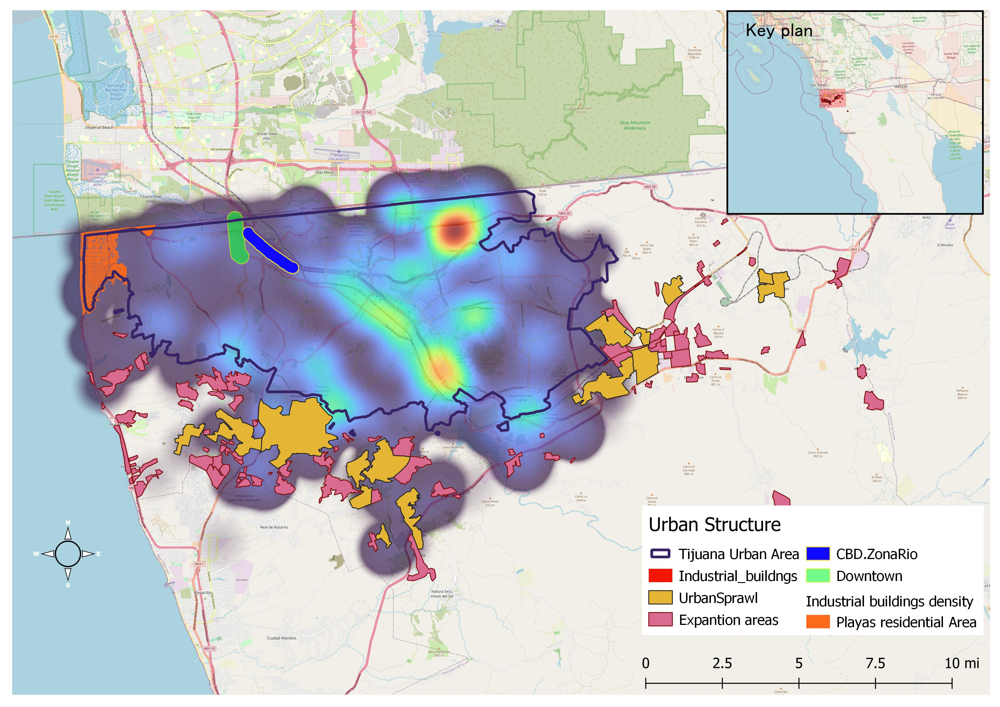

# Binational implications: The San Diego-Tijuana housing market connection.


```{r, message=FALSE,warning=FALSE,include=FALSE}
library(tidyverse)
library(ggplot2)
library(mapview)
library(leafem)
library(leaflet)
library(sf)
library(RColorBrewer)
library(plainview)
library(leafsync)
```


The housing market for Mexican cities at the US border has been attracting the attention of public policy officials and community organizations with a growing interest with particular emphasis after the 2009 financial crisis.  From the academic perspective, several investigations have documented case studies where demand for residential space by population coming from the US [@kim2020emergence], are actively shaping the real estate landscapes in the Mexican side.    

A behavior that, in turn, creates a local upward path for housing prices in particular border urban areas at the Mexican side, such as Tijuana [@floresrobertoRobertoFloresHIR2023](https://drive.google.com/file/d/14xx2p2AGKfyKWB_GFeT2w1TWtTm96ahd/view?usp=sharing), where local people facing higher housing prices are being priced-out of specific residential locations, including areas near the central business district (CBD) and the so called golden residential area, 
[@fabiantorressanchezKellerWilliamsFabian2023](https://drive.google.com/file/d/1lBY64zk_hQsV_epSw8E1MlXoA3IE665j/view?usp=sharing)  as well as the areas in close proximity to border crossings which face an increased pressure to accommodate a growing housing demand that customers and real estate investors coming from the north, create. 

Indeed, there is empirical evidence documented by expert scholars on the field, such as  Soto-Rubui and Hausman, [@SOTORUBIO201976], describing how the local real estate market in this border region, has experimented continuous pressures that has resulted in affordability challenges for residents in Mexican border cities such as Tijuana. In their remarkable research, Soto-Rubui and Hausman highlight how competition for residential space has intensified. 

In this chapter the goal is to analyze the conditions, including economic determinats, that contribute to explain the movement of people from the US into Mexican border cities shading light on the effects over local real estate markets.  The chapter considers the current housing market conditions at the biggest Mexican border city, Tijuana, Baja California. 

## Why Tijuana is important when studiying housing prices in Southern California.

Tijuana, Baja California is located at the US Mexico border just across the city of San Diego. 
Given it´s privilege location, Tijuana has become the biggest population center in all of Mexico´s norther border and a strategic economic regional manufacture hub covering a wide range of industries, including electronics, automotive parts, medical devices, aerospace components, textiles, and consumer goods and services.

Notably, the historic influx of labor which has been robust since the 1970's is underpinned by a dynamic internal migration^[within the country] of people seeking livelihoods within the manufacturing sector[@kopinak2003globalization; @gallegosTijuanaBorderMigration2009], traditionally a low wage sector of the labor force[@kopinak2020wages]. 
Although this demographic trends were propelled by public policies dating back to 1965 with the emblematic  Border Industrialization Program (BIP) and bi national regulations such as the North American Free trade Agreement, (NAFTA) which was signed in December 1992, and subsequent USMCA (signed in November 2018), currently the intense trans border movement of people is subject to additional economic determinants that include asymmetries on housing market conditions between both sides of te border.    [@chavez2016border].

This city of Tijuena currently hosts the busiest pedestrian and personal Vehicle passenger port of entry to the US along the northern Mexican Border. According to official information provided by the Bureau of transportation statistics, during 2022, California ports of entry registered 16,104,055 pedestrian crossings and among these, the San Ysidro gate, situated right at Tijuana´s city heart, accounts for 6,678,157 pedestrian crossings, [@bts], surpassing the traffic registered by second busiest port El Paso, by 82%.
Figure 1 below provides evidence to compare border crossings by port of entry along the Us Mexico border.

**Figure 1. US Mexico border North bound crossings by ports of entry. 2022: Pedestrians, Passenger vehicles, Trucks loaded and Bus passengers. **
```{r, echo=FALSE, warning=FALSE, message=FALSE}
## The map.

## Source: Bureau of Transportation Statistics (BTS) Border Crossing Data  Inbound border crossing counts. Available at: https://data.bts.gov/Research-and-Statistics/Border-Crossing-Entry-Data/keg4-3bc2/data

## Northboud crossings counts by type  2022 year totals.

Trucksloaded_geo<-readRDS("Trucksloaded_geo.csv")
Buspassangers_geo<-readRDS("Buspassangers_geo.csv")
Vehicles_geo<-readRDS("Vehicles_geo.csv")
P2022_geo<-readRDS("P2022_geo.csv")


m1<-mapview(P2022_geo, map.types =  "CartoDB.Positron",cex="Pedescross", zcol="Pedescross", layer.name= "Inbound border crossing Pedestrians",homebutton =FALSE, col.regions=brewer.pal(9, "YlOrRd"), alpha.regions = 1, aplha = 0.2)

m2<-mapview(Vehicles_geo, map.types =  "CartoDB.Positron",cex="Vehicles", zcol="Vehicles", layer.name= "Personal Vehicles passengers",homebutton =FALSE,col.regions=brewer.pal(9, "BuPu"), alpha.regions = 1, aplha = 0.2)

m3<-mapview(Buspassangers_geo, map.types =  "CartoDB.Positron",cex="Vehicles", zcol="Vehicles", layer.name= "Bus Passengers",homebutton =FALSE,col.regions=brewer.pal(9, "Blues"), alpha.regions = 1, aplha = 0.2)

m4<-mapview(Trucksloaded_geo, map.types =  "CartoDB.Positron",cex="Vehicles", zcol="Vehicles", layer.name= "Trucks loaded",homebutton =FALSE,col.regions=brewer.pal(9, "YlGn"), alpha.regions = 1, aplha = 0.2)
    
#leafem::addMouseCoordinates(mapa)%>%setView(zoom = 5.2, -106.4060849, 29.8918681)

sync(m1, m2, m3, m4)

#sync(list(m1, m2, m3, m4),sync = list(c(1, 4),                  c(2, 3)))  
#latticeView(m1, m2, m3,m4)

```
Source: José Luis Manzanares Rivera with data from Bureau of Transportation Statistics (BTS) Border Crossing Data [@bts] 

There are two patterns that deserve a careful examination, we observe a clear difference between the western border ports of entry and those located at the East side of the border. While the San Ysidro port of entry dominates the pedestrian an passenger vehicle categories, when considering commercial cargo traffic and Bus passenger crossings, we see that actually the Texas-Tamaulipas border is  where the biggest traffic volume takes place. This pattern provide evidence of different underlaying economic forces that influence the regional and local real estate markets.

For example, demand for space to lease and develop werehouse facilities is directly impacted by economic activities such as logistics which in turn are having a boost from near shoring strategies conducted by manufacturing firms associated with a tense US-China  trade relationship. The traffic that the Laredo port of entry is having in the category Trucks loaded is a reflection of the interconnected configuration that the manufacturing sector has developed within the US Mexico economomies.

In the other hand, the intense people movement observed in Tituana´s San Ysidro port of entry reflects the underlying social dynamics that this region generates[@doi:10.1177/019791839603000407] which is strongly influenced by specific economic determinants, one such key driving factor being a bi-national labor market and housing market prices differentials. 

These factors make the commuting a regular part of life at the Tijuana-San Diego Border either by pedestrians or passenger vehicles. However given the volume of border crossings in this category, there are considerable productivity losses when taking into account the wait times that this massive volume of traffic generates, an issue that has been documented elsewhere by several studies including [@haralambidesSUPPLYCHAINBOTTLENECKS2004; @rodriguezEconomicImpactMore2022;@alfaroUSMexicoCommerceTracking2023].

To understand the time involved in crossing the border,figure 2, presents a closer look at US-Mexico border ports of entry wait times for category passenger vehicles.

**Figure 2. Wait times for Passenger Vehicles. Selected US-Mexico border ports of entry Septembrer 2022**

```{r, include=FALSE}

#### Plot Wrangling ##### NO run ###

# sOURCE: U.S. Customs and Border  Protection  Historical Wait Times,  San Ysidro Port of entry Passenger lane General Lane.

#  https://bwt.cbp.gov/historical

#library(gganimate)


#wait<-read.csv("waitimes2022.csv")%>%select(-c(X,X.1,X.2))%>%mutate(day=as.factor(day))%>%na.omit()

 #options(repr.plot.width = 8, repr.plot.height = 6)

#p <- ggplot(wait, aes(Hour, wait.minutes, size = wait.minutes, colour = PortName)) +geom_point(alpha = 0.7) + scale_size(range = c(2, 12)) + scale_colour_manual(values=c("red","black","yellow2", "blue", "limegreen"),limits = c("SanYsidro", "Laredo(BridgeII)", "ElPaso(BOTA)", "Brownsville(Gateway)", "Nogales(Deconcini)"))  + theme_light()+theme(legend.position = "bottom", legend.box = "horizontal")+ guides(size = FALSE)+ labs(colour = NULL)+ scale_x_continuous(limits = c(0, 24),  breaks = seq(0, 24, by = 2),     labels = function(x) ifelse(x %% 2 == 0, as.character(x), ""),      expand = c(0, 0))+labs(title = 'Hour: {frame_time}', x = 'Hour', y = 'Wait times (min)') +transition_time(Hour) + ease_aes('linear')
  
#p
#anim_save("waitimes2022.gif", p, width = 660, height = 500) 

```


```{r,echo= FALSE,  message=FALSE, Warnig=FALSE}

library(magick)
waitimage <- image_read("waitimes2022.gif")
waitimage
```
Source: José Luis Manzanares Rivera based on data from U.S. Customs and Border  Protection.[@wait]  Historical Wait Times. Average values for Mondays, September 2022, General Lane. 

## Unaffrodable housing, urban spraw and squatter areas  a hard reality in Tijuana.

Historically, there has been several structural factors that contribute to housing shortages in the Mexican city of Tijuana.[@SOTORUBIO201976], however recently, added pressures to enter the housing market, of binational economic nature,  have emerged for the local population living in specific neighborhoods situated in close proximity to border crossings or residential areas that are particularly attractive to US commuters and remote workers coming from the southern California region, particularly from the San Diego-Chula Vista-Carlsbad metropolitan statistical area.  


As a result, a surge in real estate development has occurred in the area known as Playas de Tijuana and Rosarito, where property prices have experienced rapid growth during the last decade. 

**Figure 3. Tijuana urban configuration and industrial buildings density distribution**

```{r, echo=FALSE, warning=FALSE, message=FALSE}
industrial <-read_sf("Industrial_buildngs.shp")%>%select(osm_id,area,geometry)
industrial <-read_sf("centroids.shp")%>%
  select(osm_id,geometry)%>%st_join(industrial)%>%select( area , geometry)%>%na.omit
Industrial.Directional.Density<- read_sf("directionat.shp")
Playas<-read_sf("playastj.shp")
Urban.Area<-read_sf("outline.shp")
Urban.Sprawl<-read_sf("UrbanSprawl.shp")
Expantion.sites<-read_sf("Shantytowns.shp")
CBD.ZonaRio<-read_sf("Bufferzrio.shp")
Downtown.Revolucion<-read_sf("BufferRevolucion.shp")

## Definicion de colores para cada shape file.
deepink<-"deeppink"
purple<-"coral"
color<-"goldenrod3"
black<-"black"
rosy<-"rosybrown3"
salmon<-"salmon4"
pastel<-"paleturquoise2"
royal<-"royalblue4"


# El mapa usando mapview agregando cada capa.
#tj<-mapview(geojson_data)

tj<- mapview(industrial, legend = FALSE, cex=0.3, col.regions=deepink, alpha.regions=.5) +mapview(Playas, col.regions= color)+mapview(Urban.Area, col.regions= black, alpha.regions = 0)+mapview(Urban.Sprawl, col.regions= rosy)+mapview(Expantion.sites, col.regions= salmon)+mapview(CBD.ZonaRio, col.regions= pastel) +  mapview(Downtown.Revolucion, col.regions= royal) 

leafem::addMouseCoordinates(tj)%>%
setView(zoom = 11, -116.8932356,  32.4990096)

```

{width=100%}
Source: José Luis Manzanares Rivera with data from: Open Street map, QOSM, QGIS plug-in and INEGI open data geographic shape. 2023.

The spatial relationship between industrial building's concentration and urban sprawl, points to specific infrastructure challenges for the metropolitan area.  At the same time, it indicates a connection between a labor market dominated by the manufacture sector and the social processes such as migration that characterize the urban expansion and economic growth of this mexican border city.
As can be noted in figure 3,  the squatter areas that proliferate in the outskirts of the city around the industrial clusters, indicate disadvantages related to the availability of services that otherwise are common in the central areas of the city, areas that are no longer affordable to this population segments given  the increasing transformation of scarce apace and a dynamic short term rental markets that both local and  customers coming from the US side of the border, are consolidating. 

The future holds many  challenges for border metropolitan areas in the mexican side, whose demographic pressures linked to its particular  location, require  proactive and innovative actions to prevent the deepening of the current housing  unaffordability trend.


```{r, include=FALSE, warning=FALSE, message=FALSE}


##Source: https://www.irs.gov/statistics/soi-tax-stats-migration-data-2020-2021  

 #Amounts in thousands of dollars.

#  County-to-County Outflow    data set. 

irs<-read.csv("countyoutflow2021_IRS.csv")


#arizona_irs<-read.csv("Irs_2021_az_inflows.csv")%>%na.omit()

#names(arizona_irs)

#income<-arizona_irs%>%mutate(income_return=ag_inc/individuals, ag_inc_percent=round(ag_inc/sum(ag_inc)*100,2), returns_prop=round(returns/sum(returns)*100,2))
       
#IRS  data insights 

# Considering states flows. We find that california is the main contributor to inmigrants representing 30.4% of the total out of state IRS return filings. When analyzing data at county level  we see that Although Los Angeles county generates the biggest flow, in fact other counties located in the  state, in particular in the Silicon Valley region such as Santa clara bring greater gross incomes. The average agregate gros income for tax returns of population coming from california is 58.4 USD while Santa Clara county generates an average aggegrated gross income per return  five times larger   of 296.7 USD per tax file return).

## In addition It is found that the income, as reflected by tax returns fillings, coming from states that not necessarily represent an important proportion of movers, is actually larger than that of  Californians, the main contributor state in terms of population movements into Arizona. The population with the larger gross income per tax return filling are in fact  coming  from the following states: Illinois, District of Columbia, New Jersey, New York and Massachusetts.  

# Now, within Arizona there are specific counties and Metropolitan areas that figure as main attraction locations. As we discover in the previous chapter.The Phoenix-Chandler-Mesa MSA, located in the MAricopa County, is the principal destination for out of state flows coming to Arizona, and the main flows are coming from Los Angeles.


#az2021_county<-read.csv("az_inflows2021_county.csv")
# we ca see that the main flows are coming from  Los Angeles County in California. We can measure the importance of this flows in terms of Gross Adjusted income that individual tax returns from the IRS represent. Looking at this data, 

## County inflows  data hHERE READ READ READ IT!!!!!


## to analyze file read file and  concatenate Origin vars: State code and county code to get unique id for variable different state (filter this variable), then summarize var: number of returns at this ID filtered variable for grouped destination var:  County code. This give the total returns for counties coming from a different state.

```


```{r, include=FALSE}

################# Data wrangling ####################

## This is the previous data wrangling to get the below individual data sets. for border crossings.

#bordercrosings<-read.csv("Border_Crossing_Entry_Data.csv")%>%filter(Border!="US-Canada Border")%>%separate(Date, into = c("Month", "Year"), sep = " ", remove = FALSE)


#geo_ports<-bordercrosings%>%select(Port.Name, Latitude, Longitude)%>% distinct(Port.Name, .keep_all = TRUE)


#Measures<-bordercrosings%>%group_by(Measure)%>%count()

#Trucksloaded<-bordercrosings%>%filter(Measure=="Truck Containers Loaded"&Port.Name!="Boquillas"&Port.Name!="Ysleta"&Port.Name!="Cross Border Xpress")%>%filter(Year==2022)%>%select(-Border)%>%group_by(Port.Name, Year)%>%  summarize(Vehicles=sum(Value))
## Data revels a clear pattern for crossings differentiated by type. with commercial cargo going through Laredo which has 2.5 times the traffic of the second most important port of entry for this means of transportation category. 

## write.csv(Trucksloaded, "Trucksloaded2022.csv") 


#bus_passangers<-bordercrosings%>%filter(Measure=="Bus Passengers"&Port.Name!="Boquillas"&Port.Name!="Ysleta"&Port.Name!="Cross Border Xpress")%>%filter(Year==2022)%>%select(-Border)%>%group_by(Port.Name, Year)%>%  summarize(Vehicles=sum(Value))

## write.csv(bus_passangers, "BusPassengers2022.csv") 


##Note: Data reveals that long distance travel  is preferred through Laredo, while  Pedestrian crossings, a category associated with local interaction is strongly  conducted at  California's ports of entry. 

#Personal_Vehicles<-bordercrosings%>%filter(Measure=="Personal Vehicles"&Port.Name!="Boquillas"&Port.Name!="Ysleta"&Port.Name!="Cross Border Xpress")%>%filter(Year==2022)%>%select(-Border)%>%group_by(Port.Name, Year)%>%  summarize(Vehicles=sum(Value))

## write.csv(Personal_Vehicles, "Vehicles2022.csv") 

#pedestrians2022<-bordercrosings%>%filter(Measure=="Pedestrians"&Port.Name!="Boquillas"&Port.Name!="Ysleta"&Port.Name!="Cross Border Xpress")%>%filter(Year==2022)%>%select(-Border)%>%group_by(Port.Name, Year)%>%  summarize(Pedescross=sum(Value))

#write.csv(pedestrians2022, "pedestrians2022.csv")

## tenemos 25 Main ports of entry. Regulars since 1996. BOquillas , Ysleta y Cross Border Xpress are new and does not have consistent long term data yet.


## Cuántos ports hay en la US MX border? 

#ports<-pedestrians2022%>%group_by(Port.Name)%>%count()
# Ans. There are 28 ports of entry at the US MX border.

## Cuántos años tiene la base? 

#years<-pedestrians%>%group_by(Year)%>%count()

# ans  28 años.


#months<-pedestrians%>%group_by(Port.Name,Measure,  Year)%>%count()

#exclude<-months%>%filter(n<11)
```


```{r, include=FALSE}

######  Data Wrangling  step  2.  set spatial objects ######


## Source: Bureau of Transportation Statistics (BTS) Border Crossing Data  Inbound border crossing counts. Available at: https://data.bts.gov/Research-and-Statistics/Border-Crossing-Entry-Data/keg4-3bc2/data

#bordercrosings<-read.csv("Border_Crossing_Entry_Data.csv")%>%filter(Border!="US-Canada Border")%>%separate(Date, into = c("Month", "Year"), sep = " ", remove = FALSE)

#geo_ports<-bordercrosings%>%select(Port.Name, Latitude, Longitude)%>%distinct(Port.Name, .keep_all = TRUE)

#This is the clean data for the map

#P2022<-read.csv("pedestrians2022.csv")%>%select(-X)%>%left_join(geo_ports, by="Port.Name")
#P2022_geo <- st_as_sf(P2022, coords = c("Longitude", "Latitude"), crs = 4326)
#saveRDS(P2022_geo, "P2022_geo.csv")

#Vehicles2022<-read.csv("Vehicles2022.csv")%>%select(-X)%>%left_join(geo_ports, by="Port.Name")Vehicles_geo <- st_as_sf(Vehicles2022, coords = c("Longitude", "Latitude"), crs = 4326)
#saveRDS(Vehicles_geo, "Vehicles_geo.csv")

#Buspassangers2022<-read.csv("BusPassengers2022.csv")%>%select(-X)%>%left_join(geo_ports, by="Port.Name")Buspassangers_geo <- st_as_sf(Buspassangers2022, coords = c("Longitude", "Latitude"), crs = 4326)
#saveRDS(Buspassangers_geo, "Buspassangers_geo.csv")

#Trucksloaded2022<-read.csv("Trucksloaded2022.csv")%>%select(-X)%>%left_join(geo_ports, by="Port.Name") Trucksloaded_geo <- st_as_sf(Trucksloaded2022, coords = c("Longitude", "Latitude"), crs = 4326)
#saveRDS(Trucksloaded_geo, "Trucksloaded_geo.csv")

```


