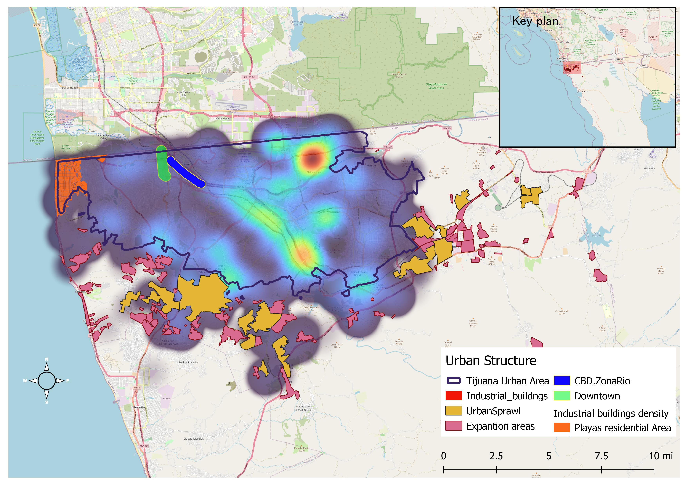

--- 
title: "Patrones espaciales de migración interna asociados a las fluctuaciones en el mercado inmobiliario."
author: "José Luis Manzanares Rivera"
date: "`r Sys.Date()`"
site: bookdown::bookdown_site
output: bookdown::bs4_book
always_allow_html: true
documentclass: krantz
bibliography: [Housing_border_cities_library.bib, packages.bib]
biblio-style: apalike
link-citations: yes
colorlinks: yes
graphics: yes
description: "This is a research about housing access conditions for the mexican populaion living in cities located along the northern border. It provides a current characterization of the economic conditions that prevail in border communities and dive into emerging forces that shape the real state industry today in this strategic region."
cover-image: "images/cover1.jpg"
url: https://price-out.netlify.app/
---

# XLIII CONGRESO NACIONAL Y XXVIII INTERNACIONAL DE GEOGRAFÍA
DE LA SOCIEDAD CHILENA DE CIENCIAS GEOGRÁFICAS.

**Valdivia**, Región de los Rios, Chile.

Noviembre 2023.


<hr>

## Contribute to the project  {-}

If you find the research helpful, you can contribute to the project by:

- Sharing it with your team and networks.

- Commenting on digital media, for example, using the hashtag #Housingontheborder on X.

- Citing it or linking to it.

- Enjoy the read by purchasing a copy at: [BlackDogPublishing]()

- You can also download a **free** copy in PDF or epub format.


<a rel="license" href="http://creativecommons.org/licenses/by-nc-nd/4.0/"></a><br />This work is licensed under a <a rel="license" href="http://creativecommons.org/licenses/by-nc-nd/4.0/">Creative Commons Attribution-NonCommercial-NoDerivatives 4.0 International License</a>.

```{r, echo=FALSE, warning=FALSE, message=FALSE}
library(downloadthis)

download_link(
  link = "https://www.dropbox.com/s/g9jz1nzh3nc2dns/Chile3030.pdf?dl=0",
  button_label = "Download PDF file",
  button_type = "danger",
  has_icon = TRUE,
  icon = "fa fa-save",
  self_contained = FALSE
)

```


```{r include=FALSE}
# automatically create a bib database for R packages
knitr::write_bib(c(
  .packages(), 'bookdown', 'knitr', 'rmarkdown'
), 'packages.bib')
```

# Prologue {-}


> *"Real estate is an imperishable asset, ever increasing in value. It is the most solid security that human ingenuity has devised. It is the basis of all security and about the only indestructible security"*    
<div style="text-align: right"> --- Russell Sage</div>

Economic relationships between Mexico and the US have been increasing at a dynamic pace during the first decades of this century. Partially responsible for this trend are specific policy instruments that have been designed to deliver a mutual benefit for the interests of both countries.

Although particular economic sectors have been shaped by this partnership,  when considering strategic regions such as the US Mexico border, it is argued that the growing integration represents an opportunity area for local development. 

From a public policy perspective one of those areas of concern  where there is a growing interest to understand bi national interaction is housing prices and the underlying real state markets. 

Specially given that housing markets are closely related to economic determinants, including labor market dynamics, that influence a series of important social processes such as migration patterns; understanding house price fluctuations can be particularly relevant for regional development.

Considering an economic perspective, there are at least five key indicators that demonstrate the increasing US-Mexico integration: trade patterns and resulting supply chain links, productive investment, labor market dynamics, remittances trends and tourism flows.

Considering the exchange of goods and services, according to United States Census Bureau, based on data from the Foreign Trade Division, in 2020, Mexico was the US's second-largest goods trading partner, with a total of $577.6 billion in two-way trade [@usmexicotrade2020].

To place in perspective this trade volume, a contrast  against the size of the whole Mexican economy measured by the gross domestic product, revels that the US-Mexico trade value accounted for 52.9%^[it can be argued that this figure overestimates the trade relationship between both countries since the maquiladora industry, an important component of the trade sector, includes many production processes that require a input to cross the border many times before it reaches the final product.] of the total Méxican GDP in 2020,[@inegiProductoInternoBruto2023],[@mexicoeconomy2020] a robust figure if we consider China, Méxicos´s second largest trading partner after the US, whose´s trade value, accounted for a 7.6%[@mexicoeconomy2020], [@worldbank-mexico-gdp]  share of the country´s GDP for the same period of time. 

Furthermore, the Mexican total trade volume in 2020 was worth in current prices 1.03 trillion,[@worldbank2020mexico] which means that the US-Mexico trade volume represented over half of all Mexican world trade.

The US-México trade relationship was further propelled by the implementation of the (USMCA) agreement, also known in Spanish as the T-MEC (Tratado entre México Estados Undos y Canadá), which was created during the Trump administration and signed by member countries on November 30, 2018, during the G-20 summit in Buenos Aires, Argentina [@ustr2018usmca].

When productive investment is considered, particular regions in México have turned into strategic logistic hubs and supply chain pillars to support the manufacturing and resulting trade flows that currently define the US-Mexico economic relationship. 

Among this regional economic hubs, the Mexican northern border represent a clear example, where geographic proximity enables efficient productive integration between both countries. 

Current features of the global economy impacting the north american region such as near-shoring, a trend partially influenced by a less dynamic post pandemic US-China relationship, are expanding productive partnerships between Mexico and the US in cities across it's share border region with tangible results on important local markets.

Additionally, as the Mexican population living in the US has increased, the total amount of money sent from the US to Mexico has experienced a significant growth over the past few decades and have developed into a major source of foreign currency.

According to the World Bank, total remittance volume from the US to Mexico increased from \$2.4 billion in 1995 to \$40.6 billion in 2020, [@worldbank_remittances] furthermore in 2020, remittances accounted for 4.2% of Mexico's GDP.[@bankofmexico_remittances] which places the country among the highest remittances recipients in the world. 

Although this robust currency flow indicates a high level of economic and labor market interaction between both countries, Mexico´s dependence on external sources of income highlights an area of opportunity regarding sustainable economic development and job creation within the country that has been regarded by some scholars such as  [@lopez2020economic], [@1ILEGAL], as one of the causes of north bound irregular migration in the first place.  

Whereas economic ties among the two countries are a clear indication of a strong integration and provide a portrait of underlying productive structure and it´s related labor markets, there are several industries where economic asymmetries have been developing impacting local communities and its residents. 

Empirically it can be argued that each of these economic features has been influencing most of Mexican regions, with wide scale impacts, going beyond the economic sphere, ranging from environmental, urban planning and public health, however a particular geographic region where this economic structure translates into a continuous tangible social development process is the Mexican northern border. 

At a regional scale and particularly considering the US-Mexico border population centers, one of such areas where impacts are of concern, is real state and the resulting housing market.

While the manufacturing industrial sector demand for warehouse space for instance, has been a key driver of commercial land prices in these border urban areas, until recently, less understood were Mexico´s northern border city´s residential housing patterns. 

A central argument for this work is that explaining regional economic dynamics is relevant to better understand local scale opportunities that the US-Mexico relationship offers to improve border residents´s quality of life.

Following a data driven approach this research work  analyzes housing prices on US Metropolitan areas and internal migration patterns within US states, with a focus in California and it´s southern border region. 

This analysis is important to understand recent real state features such as residential space demand at bi-national urban areas and to provide key insights not just to implement adaptation policies to prevent negative side effects, but to design strategies based on evidence to guide a long run development process.        


# Introduction  {-}

**Border economic landscapes and underlying structural conditions**

Economic relationships between Mexico and the US have been increasing at a dynamic pase during the first decades of this century. Partially responsible for this trend are specific policy instruments that have been designed to deliver a mutual benefit for the interests of both countries.

However at a local scale, particular economic sectors have been shaped by this partnership. From a public policy perspective one of those areas of concern  where there is a growing interest to understand bi national interaction is housing prices and the underlying real state markets. 

Specially given that housing markets are closely related to economic determinants, including labor market dynamics, that influence a series of important social processes such as migration patterns; understanding house price fluctuations can be particularly relevant for regional development.

Considering an economic perspective, there are at least five key indicators that demonstrate the increasing US-Mexico integration: trade patterns and resulting supply chain links, productive investment, labor market dynamics, remittances trends and tourism flows.

Considering the exchange of goods and services, according to United States Census Bureau, based on data from the Foreign Trade Division, in 2020, Mexico was the US's second-largest goods trading partner, with a total of $577.6 billion in two-way trade [@usmexicotrade2020].

To place in perspective this trade volume, a contrast  against the size of the whole Mexican economy measured by the gross domestic product, revels that the US-Mexico trade value accounted for 52.9%^[it can be argued that this figure overestimates the trade relationship between both countries since the maquiladora industry, an important component of the trade sector, includes many production processes that require a input to cross the border many times before it reaches the final product.] of the total Méxican GDP in 2020,[@banxicoSistemaInformacionEconomica2023],[@mexicoeconomy2020] a robust figure if we consider China, Méxicos´s second largest trading partner after the US, whose´s trade value, accounted for a 7.6%[@mexicoeconomy2020], [@worldbank-mexico-gdp]  share of the country´s GDP for the same period of time. 

Furthermore, the Mexican total trade volume in 2020 was worth in current prices 1.03 trillion,[@worldbank2020mexico] which means that the US-Mexico trade volume represented over half of all Mexican world trade.

The US-México trade relationship was further propelled by the implementation of the (USMCA) agreement, also known in Spanish as the T-MEC (Tratado entre México Estados Undos y Canadá), which was created during the Trump administration and signed by member countries on November 30, 2018, during the G-20 summit in Buenos Aires, Argentina [@ustr2018usmca].

When productive investment is considered, particular regions in México have turned into strategic logistic hubs and supply chain pillars to support the manufacturing and resulting trade flows that currently define the US-Mexico economic relationship. 

Among this regional economic hubs, the Mexican northern border represent a clear example, where geographic proximity enables efficient productive integration between both countries. 

Current features of the global economy impacting the north american region such as near-shoring, a trend partially influenced by a less dynamic post pandemic US-China relationship, are expanding productive partnerships between Mexico and the US in cities across it's share border region with tangible results on important local markets.

Additionally, as the Mexican population living in the US has increased, the total amount of money sent from the US to Mexico has experienced a significant growth over the past few decades and have developed into a major source of foreign currency.

According to the World Bank, total remittance volume from the US to Mexico increased from \$2.4 billion in 1995 to \$40.6 billion in 2020, [@worldbank_remittances] furthermore in 2020, remittances accounted for 4.2% of Mexico's GDP.[@bankofmexico_remittances] which places the country among the highest remittances recipients in the world. 

Although this robust currency flow indicates a high level of economic and labor market interaction between both countries, Mexico´s dependence on external sources of income highlights an area of opportunity regarding sustainable economic development and job creation within the country that has been regarded by some scholars such as  [@lopez2020economic], [@1ILEGAL], as one of the causes of north bound irregular migration in the first place.  

Whereas economic ties among the two countries are a clear indication of a strong integration and provide a portrait of underlying productive structure and it´s related labor markets, there are several industries where economic asymmetries have been developing impacting local communities and its residents. 

Empirically it can be argued that each of these economic features has been influencing most of Mexican regions, with wide scale impacts, going beyond the economic sphere, ranging from environmental, urban planning and public health, however a particular geographic region where this economic structure translates into a continuous tangible social development process is the Mexican northern border. 

At a regional scale and particularly considering the US-Mexico border population centers, one of such areas where impacts are of concern, is real state and the resulting housing market.

While the manufacturing industrial sector demand for warehouse space for instance, has been a key driver of commercial land prices in these border urban areas, until recently, less understood were Mexico´s northern border city´s residential housing patterns. 

A central argument for this work is that explaining regional economic dynamics is relevant to better understand local scale opportunities that the US-Mexico relationship offers to improve border residents´s quality of live.

Following a data driven approach this research work  analyzes housing prices on US Metropolitan areas and internal migration patterns within US states, with a focus in California and it´s southern border region. 

This analysis is important to understand recent real state features such as residential space demand at bi-national urban areas and to provide key insights to design strategies based on evidence to    guide a long run development process.         

This book is organized into 4 chapters: Chapter I sets the stage to understand House prices across U.S Metropolitan areas  and links this prices to economic policy in particular to monetary policy decisions, Chapter II analyzes internal migration patterns in detail considering social implications.  Chapter III Presents the regional implications for Metropolitan area´s development considering the migration flow between Phoenix, Glendale Mesa Metropolitan Statistical Area in the Arizona  desert and the exodus from California. This chapter includes an analysis of IRS records as well as a careful consideration of the homelessness problem associated to non affordable housing conditions observed in specific Metropolitan Areas around the country.  The final chapter explores bi national real estate market implications at a regional scale focusing on the US Mexico border presenting an emblematic case study:  the San Diego-Tijuana connection.


<!--chapter:end:index.Rmd-->

# House prices, interest rates and investment opportunities. 


```{r, echo=FALSE, include=FALSE, message=FALSE, warning=FALSE}
library(dygraphs)
library(mapview)
library(leafem)
library(tidyverse)
library(sf)
library(leaflet)
library(gganimate)
library(gifski)
library(png)
library(ggrepel)
library(scales)
library(plotly)
library(ggthemes)
library(xts)
library(zoo)
library(htmltools)
library(stringr)
library(broom)
library(ggeasy)
library(usmap) 
library(htmlwidgets)
```


From an economic perspective, house prices represent a main component of inflation, overall price level trends are currently a priority for economic policy in general and particularly relevant when studying residential mobility.

Empirical evidence reported by current academic research  [@https://doi.org/10.1002/psp.2412] as well as market experts [@s&p/case-shillerEconomicData2023], indicate that, beyond labor market incentives, housing affordability represent a key factor when considering the selection of a place to reside [@FUSS201635].

In fact, real state markets may play a critical role for important social processes such as migration, both internal (within the same country)^[For the purposes of this investigation, internal migration is defined as the change in residence location from one particular Metropolitan area to another] or international. 

In this chapter, exploratory data analysis is conducted on house property values, focusing on metropolitan areas as the geographic scale across the US.  

Metropolitan areas are geographic units that are particularly suited to understand regional real state dynamics and provide a base scenario to study internal migration patterns within the US territory as well as specific regions such as the US-Mexico border.

## Data and methods.

The study strategy follows a spatial and temporal design, it is argued that analyzing housing costs evolution in a geographic context may reveal patterns that help to better understand residential mobility and deliver valuable insights about internal migration flows and the underlying regional economic incentives.

The primary spatial unit of analysis for this study is the Metropolitan Statistical area (MSAs). MSAs are geographical regions defined by the Office of Management and Budget (OMB) that consist of one or more counties that contain a core city of 50,000 or more inhabitants, and surrounding areas with significant social and economic ties [@ofr1990federalregister]. 

It is argued that Metropolitan statistical areas provide an appropriate level of detail, improving over the aggregate perspective that states offer or the traditional county boundaries scale, which lack the economic synergies and the broad social component that MSAs achieve by considering the interaction between a core and a set of adjacent communities. For this theoretical considerations MSAs were selected over other alternative geographical scales for this particular analysis. 

The study covers all 48 continental adjacent US states, excluding: District of Columbia, Alaska and non continental territories Hawaii and Puerto Rico.

A primary goal is to explore real state market fluctuations over time, to achieve this purpose we measure three concepts: house price levels, price appreciation and purchasing parity based on housing prices. 

To measure house price levels the main input variable is the quarterly seasonally adjusted house price index for the period 1995:Q1 (base year) to 2022:Q4 for 387 MSAs for which  Federal housing finance agency  (FHFA) price indices are available. 

The FHFA House Price Index (FHFA HPI) is a broad economic measure of the movement of single family house prices in the United States [@fhfaHousePriceIndex2022].  The data set analyzed in this chapter contains purchase only  transactions, the aim is to capture the price level fluctuations a feature estimated by using sales price data as opposed to appreciation. (which considers a repeat transaction methodology).

To measure the underlying rate of appreciation of a given house price, the Freddie Mac House price index (FMHPI), is incorporated. This is a repeat transaction index, which compares the price of the same property over two or more transactions and is explicitly designed to capture appreciation while holding constant basic factors such as physical location, climate, housing type, etc.,between transactions. [@freddiemacFreddieMacHouse2023].

By construction, therefore, the repeat transaction requirement exclude new homes.

Whereas HPI in data sets such as FHFA, measures current price level not considering transactions over the same property.  

To complement the perspective obtained by the Federal housing finance agency HPI data and the Freddie Mac HPI,  the housing component of the regional price parities (RPPs) indicator for year 2022 (the latest release as the time of writing this investigation) is included.

This is an official indicator reported by the Bureau of economic analysis (BEA) which measure the differences in price levels across states and metropolitan areas for a given year and are expressed as a percentage of the overall national price level [@bureauofeconomicanalysisRegionalPriceParities2023]. 

This indicator is particularly informative of the population purchasing power, specially it allows price comparisons relative to the national average.

To capture demand side factors, Official population estimates from the US Census Bureau were obtained for years 2010-2020 [@uscensusbureauPopulationEstimatesEstimated2023], this is a variable that captures demographic dynamics overtime and serve as a proxy for housing demand.  

Per capita personal Income (PPI) by metropolitan area from the U.S. Bureau of Economic Analysis is also included.
[@bureauofeconomicanalysisPersonalIncomeCounty2023]. This variable contributes to capture inequality and financial barriers to access the housing market. In addition the income to house price ratio is useful to inform on the contextual factors affecting the decisions to move. 

A second goal of this chapter is to reveal the impact of monetary policy shifts on housing demand by examining time series data for interest rates. Specifically, we analyze how changes in interest rates influence the demand for home loans, which, in turn, has a significant effect on home prices.

Interest rates serve as a crucial macroeconomic indicator that directly affects the demand for housing. By exploring the dynamics of interest rates over time, we aim to shed light on the influential role they play in shaping housing market trends in the presence of external economic shocks, particularly important during the study period we document: a)  the effect of the so called "Great Recession" related to the sub-prime mortgage market collapse in 2009 and b) the global health emergency declaration of early 2020.

A third goal is to analyze non-conventional economic data^[Conventional economic data is defined for the purposes of this investigation as repositories generated by the Census Bureau, Bureau of economic analysis and federal agencies and institutions that provide estimates, projections and indicators related to the housing market], to understand the population sentiment towards the housing market, we propose the use of the Google trends tool. 

This tool provides insights into the relative popularity of search terms over a particular period of time and across different regions. And it has become a relevant source for academic research recently from areas in the social sciences field as well as other disciplines such as natural sciences and public health. [@askitasTrendSpottingHousingMarket2016], [@avramescuNowcastingRomanianMigration2021], [@vazquezGRANDESDATOSGOOGLE2020], [@kamMonitoringDroughtAwareness2019].

By analyzing the search volume data obtained from Google Trends, this data source allows us to observe and compare the changes in interest and search patterns for various topics using a score in the close domain [0-100], where 100 indicates the highest volume of searches for a particular place and time and 0 indicates the lowest volume for the term at a precise moment in time and location.

By analyzing the search behavior of internet users, Google Trends offers a valuable resource for understanding the relative level of interest and attention that a topic or keyword generates within the online population. We analyze three important words that characterize equal number of aspects for the US housing markets: affordable home, Foreclosure and eviction. 
This keywords allow to answer questions on where and when does people (Google users) are looking for this words, specially the term Foreclosure, serve as a proxy for home owners interest whereas eviction represents the renter´s segment. 


## Results.

The analysis is organized in two stages: the first provides a national approach to the housing prices fluctuations for state and MSA scales. While the second focuses on the US Mexico border region.

When we analyze real estate market fluctuations in the context of affordability housing, understanding regional inflation patterns is crucial. In particular in this section the analysis starts by exploring the housing component for the regional price parity (RPP), this is an indicator developed by the Bureau of Economic Analysis (BEA) to measure price fluctuations at a regional scale. 

By xamining this aggregate economic indicator it is possible to distinguish which states of the country exhibit the most expensive housing markets and therefore which areas of the country represent particular challenges either for households entering the market or those families already paying a mortgage. 


Regional price parties capture variations in the cost of living across different region of the country, this indicator is important because it helps to understand the relative purchasing power and living standards in different geographic areas and particularly when considering the housing component, it provides a measure to compare the real estate market conditions relative to the country.  

The RPP base level is the national average which takes a value of 100, so RPP values above this national threshold indicate relative more expensive states in terms of housing prices.

Figure 1 shows regional price parities by state relative the average US for 2021

[Figure 1 Regional price parities (RPP) by state 2022](../speech/F1_rpp.html).  
```{r, echo=FALSE, warning=FALSE,message=FALSE}

### Plot  For Regional price parities for the housing component

## Loading the data set.   REGIONAL PRICE PARITIES
# Source: 

prices<-read.csv("prices.csv")%>%
  mutate(type=as.factor(type), type=ifelse(type==0, "Below avg", "Above avg"))%>%
  filter(!row_number() %in% 9)%>%
  filter(state!="Alaska" &  state!="Hawaii")


### Plot  

rppp<-ggplot(prices, aes(x = reorder(state,rppindex), y=rppindex, fill = type))+ 
  geom_col()+  
  coord_flip()+
  theme_minimal()+
labs(fill="RPP")+
theme(legend.justification=c(1,0), legend.position=c(.9,.4))+
ylab("Housing component of RPP. (%) Deviation")+
xlab("State")+
annotate("text", x="Alabama", y=50, size=3.1,label="US Housing RPP=100 per cent")+
  annotate("text", x="California", y=70, size=3.1,label="64.9")+
  annotate("text", x="Arizona", y=6, size=3.1,label="2.4")+   annotate("text", x="Texas", y=-8, size=3.1,label="-4.4")+ 
   annotate("text", x="NewMexico", y=-30, size=3.1,label="-27")+
scale_fill_manual(values=c("deepskyblue4","firebrick"), labels=c("Below average","Above average" ), name="")+
  theme(legend.position = "bottom", legend.title = element_blank()) 

ggplotly(rppp)%>%
  layout(legend = list(orientation = "h", x = 0, y = -.05))

#htmlwidgets::saveWidget(widget = rppplot, 
#the plotly object file = "C:/Users/josel/Desktop/on/I/2023/HOUSING/realstate/speech/F1_rpp.html", 
#the path & file name selfcontained = TRUE #creates a single html file)


 #ggsave("rpp2022_housing_USstates.tiff", width = 25, height = 17, units = "cm",dpi=300)
```
Source: José Luis Manzanares analysis of Regional price parities based on data from [@bureauofeconomicanalysisRegionalPriceParities2023]


It can be seen that the US west coast border state of California has the highest housing price parity among the 48 states (excluding Hawaii, Alaska and DC) for 2021. This  pattern suggest financial pressures for residents in west coast states that may influence the current out of state internal migration documented by academic research elsewhere [@blumenbergJobsHousingBalance2021] for states such as California.

In order to get a higher level of detail on the behavior of house price fluctuations,  metropolitan statistical areas around the country are now analyzed, considering the House price index developed by the Federal Housing Finance Agency, ^[indicated as FHFA for further reference in this work], this measure is explicitly designed to capture fluctuations of the housing market since it includes prices of new homes as discussed in the methodology section of this chapter.  

The data analysis strategy design aims to extract the changes in prices over a two decade time frame for each metropolitan area so, we are able to measure not only which metropolitan areas have registered the bigger price gains between 2000 and 2020 but also it´s annual rate of growth. 

Measuring price fluctuations using the HPI developed by an independent federal agency such as FHFA, is important for two reasons in the context of this investigation: I) It informs on the potential changes on home equity fluctuations over time with a geographic perspective, which expose real estate investment opportunities  II) It reflects existing financial barriers and/or opportunities to entry into the housing market for households looking to relocate, so is an appropriate economic indicator that helps to explain  current internal migration patterns.  

Figure 2 below shows the House Price index (HPI) distribution across the 387 U.S. Metropolitan statistical areas as of 2020. Each circle represents a HPI measure with its size corresponding to the HPI value.

The index depicts housing market prices taking 1995 as base year.  So higher values indicate a relative average increase overtime and therefore more expensive locations than those with smaller circles.   

[Figure 2 Home price index HPI ](../speech/F2map.html).

```{r,  warning=FALSE, message=FALSE, echo=FALSE}

## This datas set contains 387   MSA as of  2020 with geo atribututes and avg hpi  2020  base year is 1995   which means that HPI for uS is 100% in 1995. The avg_q  variable takes into account a mean for q1,q2,q3,q4  in the given year.

df<-readRDS("datageo2020.rds")%>%rename(Year=yr, MSA=msa.x, Annual.HPI.growth00.20=gwr00_20, State=state)


# Adding a factor  variable for border states 
df <- st_as_sf(df,  crs = 4326)
ca<-filter(df,State==" CA"|State==" CA (MSAD)")
# Interactive Map 

mapviewOptions(vector.palette=colorRampPalette(c("blue","orange","red")))

mapa<-mapview(df, map.types =  "OpenStreetMap.DE",cex="hpi20", zcol="hpi20", layer.name= "MSA House Price Index",legend = FALSE,homebutton =FALSE)
  
leafem::addMouseCoordinates(mapa)%>%setView(zoom = 3.6, -96.5716694, 39.1836082)

#htmlwidgets::saveWidget(widget = mapita, file = "C:/Users/josel/Desktop/on/I/2023/HOUSING/realstate/speech/F2map.html",  selfcontained = TRUE)
```
Source: Jose Luis Manzanares Rivera based on  House price index data from [@fhfaHousePriceIndex2022]


Empirical findings reveal a pronounced surge in housing prices, as gauged by the House Price Index (HPI), within geographically delineated metropolitan areas across the United States. Noteworthy regions exhibiting such trends encompass metropolitan statistical areas (MSAs) situated along the West Coast, the southeastern part of Florida, and the northwestern region. Over the span of the past three decades, these identified regions have witnessed substantial increase in housing values.

Among the states located on the West Coast, the State of California is particularly outstanding with areas of concern such as the Bay area where the so called Silicon Valley region represents a mayor labor market hub particularly for highly skilled workers associated with the technology sector. This geographic area holds substantial economic importance due to its concentration of technological innovation, fostering an environment  that attracts and sustains a skilled workforce with above average income which also translates into relevant tax revenue sources for the entire state. 

Furthermore within California, and right at the US southern border, the San Diego MSA, ranks among the top 10 most  expensive metropolitan areas of the entire state with a relative house price increase of 363.6 per cent in the last 25 years.

Using the above estimated pattern it is convenient to determine **which metropolitan areas registered the highest price increments since base year 1995** according to the Federal House Finance HPI? 

Figure 3 illustrates the ranking of the nation's 20 foremost metropolitan areas based on their respective positions in the House Price Index (HPI) for the year 2020. It is important to note that these areas signify the highest relative increases in home prices compared to the base year of 1995, rather than indicating the absolute highest-priced urban population centers. 

[Figure 3 Top 20 Metropolitan areas by HPI increase 2020](../speech/F3_top20.html)
```{r, include=FALSE}
#df<-readRDS("datageo2020.rds")

#msa2020<-readRDS("msa2020.rds")%>%  mutate(State=as.factor(ifelse(state==" CA"|state==" CA (MSAD)","California","Other state")), top2022=ifelse(hpi>=479.435,1,0))%>%mutate(MSA=fct_reorder(msa, hpi))%>%  rename(place_id=cbsa_code)

#df<-readRDS("datageo2020.rds")

#top20<-df%>%slice_max(hpi20, n=20)%>%  mutate(State=as.factor(ifelse(state==" CA"|state==" CA (MSAD)","California","Other state")))

#saveRDS(top20, "top20.rds")
```

```{r,echo=FALSE}
top20<-readRDS("top20.rds")%>%
rename(Place=State, State=state)  
## The plot.

top20_hpi<-ggplot(top20, aes(hpi20, reorder(msa.x, hpi20), label=State, fill=Place))+
  geom_col()+
  scale_fill_manual(values = alpha(c("dodgerblue4", "gray")),name="")+
  labs(
    x = 'House Price index 2020. (1995=100 percent)',
    y = 'Metropolitan statiscal areas (MSAs)')+
  theme(legend.position="bottom")

ggplotly(top20_hpi)%>%
  layout(legend = list(orientation = "h", x = 0, y = -.05))

#htmlwidgets::saveWidget(widget = f3top20, file = "C:/Users/josel/Desktop/on/I/2023/HOUSING/realstate/speech/F3_top20.html",  selfcontained = TRUE)

```
Source: Jose Luis Manzanares Rivera based on  House price index data from [@fhfaHousePriceIndex2022]

[Figure 3a House price index annual growth rate 1995-2022](../speech/F3a_panel_growth.html)

```{r, include=FALSE}
#floflo<-data.frame(f=c(" FL"))

#rate<-readRDS("rate.rds")%>%mutate(geo=as.factor(ifelse(state%in%border_st$border,"USMXBorder", ifelse(state%in%floflo$f,"Florida","No Border"))))
                                         
#rate$msa[rate$msa=="Fort Lauderdale-Pompano Beach-Sunrise"] <- "Fort Lauderdale"

#rate$msa[rate$msa=="West Palm Beach-Boca Raton-Boynton Beach"] <- "West Palm Beach-Boca Raton"

#rate$msa[rate$msa=="San Francisco-San Mateo-Redwood City"] <- "San Francisco-Redwood City"

#saveRDS(rate, "rate.rds")
```

```{r, echo=FALSE}

rate<-readRDS("rate.rds")

cols <- c( "#E74C3C","#154360", "#1E8449")
          
tsplot<-ggplot(rate, aes( Year, AnnualGrowth,color=geo, label = state))+
  geom_line(linewidth=.3) + 
facet_wrap(~msa, scales = "free_y")+
  geom_hline(yintercept=0)+
  geom_vline(xintercept=2009, linetype="dotdash")+
  scale_color_manual(values = cols, name="")+
  labs(y="Annual HPI growth rate (%)")
  
ggplotly(tsplot)%>%
layout(legend = list(orientation = "h", x = 0, y = -.05))


#htmlwidgets::saveWidget(widget = panel, file = "C:/Users/josel/Desktop/on/I/2023/HOUSING/realstate/speech/F3a_panel_growth.html",  selfcontained = TRUE)
```
Source: Jose Luis Manzanares Rivera based on  House price index data from [@fhfaHousePriceIndex2022]

We now examine four discernible patterns that emerge when analyzing the top 20 metropolitan areas with the highest appreciation rates as measured by the annual growth on the HPI during the last 27 years: 

I) The importance of the US Mexico border region. $40\%$ of the top 20 (MSAs) with the highest appreciation rates are located at border states with Mexico.

II) Within the US Mexico border, the importance of California state is clear, representing $75\%$ of the border MSA with highest HPI growth. In fact San Diego-Chula Vista-Carlsbad exhibits the highest annual increase in 2022 with a $18.55\%$  
II) The real state market in Florida shows the fastest growing level of prices with sharp increases particularly during the Trump administration, with Metropolitan areas such as West Palm Beach, North Port-Sarasota-Bradenton, Naples Marco Island and Tampa featuring double digit increases with a maximum increase of $32.77\%$ the highest HPI annual growth in the nation.   

III) Traditional non high HPI areas in border states such as Texas are now starting to gain dynamism, the clear example in this region is the Austin-Roundrock-Georgetown Metropolitan area, where external economic factors such as the recent establishment of companies to support the electric vehicle industry have contribute to create speculative pressures on local real estate  markets.^[In 2020, Tesla announced its decision to build a Gigafactory in Austin, which currently  manufactures electric vehicles and attracts thousands of employment opportunities. Suppliers, service providers, and other companies in the electric vehicle industry have begun to establish operations near the Gigafactory, creating additional job opportunities and further contributing to housing demand. The presence of a major company like Tesla often attracts real estate investors looking to capitalize on the economic growth and potential appreciation in property values. Increased investor interest can lead to higher demand for housing, further impacting the housing market dynamics.] 

Although the above spatial patterns offer detailed empirical evidence to understand the incentives for population movements between metropolitan areas within states, one question that arises in the context of economic determinants of house prices is:  What role does available economic policy instruments have played to shape the US real state markets in the last two decades? 

### Interest rates as a key macroeconomic policy instrument shaping real estate decisions.

Certainly this period has witnessed at least two of the most remarkable and complex scenarios in economic recent history that deserve to be explained given its relevance for US society in general and households paying a mortgage in particular: **I) the Great Recession**, the economic downturn that occurred between December 2007 and June 2009. II) **The COVID19 health emergency** declared in January 2020.

In accordance with conventional economic theory, a fundamental factor influencing the overall fluctuations in the aggregate price level is the cost of borrowing, formally known as the interest rate. Interest rates are a core instrument of monetary policy that play a pivotal role in shaping economic dynamics and has significant implications for various sectors of the economy, including real estate markets. 

Therefore, understanding the evolution in time of interest rates is crucial for comprehending not only the aggregate price level fluctuations, but also its impacts on particular components, among which housing prices bear a specially important role for households. 

We now turn to the analysis of this important macroeconomic determinant and begin by presenting the trajectory overtime for the Federal Funds effective rate. 
This rate serves as a benchmark or reference point for other short-term interest rates, exerting a considerable influence on the overall cost of borrowing and lending in the economy.

The importance of the **Federal Funds effective rate (FFER)** is particularly pronounced in relation to the housing sector and real estate markets. Firstly, it directly affects the cost of mortgage borrowing for home buyers. Changes in the Federal Funds rate can lead to adjustments in mortgage interest rates, impacting affordability and demand for housing. Lower rates tend to stimulate borrowing and housing activity, while higher rates may dampen demand. This inverse relation is paramount to explain supply and demand side factors that have been taking place in the US housing market as we will soon discover. 

Figure 4, presents the evolution of the FFER in the period from  to July 2000 to May 2023. 

[Figure 4 Monetary policy: The federal Funds Effective rate evolution July 2000  May 2023](../speech/F4_FFER.html)
```{r, echo = FALSE}

# FFER plot 

ts_FFER<-readRDS("ts_FFER.rds")

dygraph(ts_FFER)%>% 
dyRangeSelector()%>%
dyHighlight(highlightCircleSize = 3, 
highlightSeriesBackgroundAlpha = 0.2
)%>%
dySeries("FEDFUNDS", color = "#D35400",fillGraph = TRUE,label ="Federal Funds Effective Rate")%>%
dyAxis("y", label = "Percent")%>%
dyLegend(width = 300)%>%
dyEvent("2008-07-01", "QE Subprime mortgage market collapse", labelLoc = "top", color = "black")%>%
dyEvent("2020-02-01", "NBER Economic recession: QE -Ultra Low interest rates-", labelLoc = "top", color = "blue")%>%
  dyEvent("2022-02-01", "Monetary policy change ending quantitative easing", labelLoc = "top", color = "red")%>%
dyOptions(axisLineWidth = 1.5, fillGraph = TRUE, drawGrid = FALSE)

#htmlwidgets::saveWidget(widget = ts_FFERp, file = "C:/Users/josel/Desktop/on/I/2023/HOUSING/realstate/speech/F4_FFER.html",  selfcontained = TRUE)

# Source: https://fred.stlouisfed.org/series/FEDFUNDS
```

Source: José Luis Manzanares Rivera based on data from Federal Reserve. [@boardofgovernorsofthefederalreservesystemFederalFundsEffective2023]

The representation above covers 23 years of Federal Funds effective rate fluctuations. Over the span of this period, monetary policy has experienced important changes with implications for the housing markets. 

The first, marked here with a benchmark date in reference to the **sub-prime mortgage market collapse** ^[Sub-prime mortgage is defined here as higher-risk loans granted to borrowers with lower creditworthiness], An episode in the recent economic history of the United States that embodies one of the primary determinants shaping the so called  **"Great Recession."**

Prior to this period, the Federal Reserve´s monetary policy had set the FFER at $5.26\%$ which its the highest interest level that US society has experienced between July 2007 and the moment of the writing of this work (May 2023).

Following the sub-prime mortgage market collapse, which set the stage for the beginning of the global financial crisis, the US central bank, decided to implement measures via the its key monetary policy instruments, to stimulate the economy. 

Considering the substantial scale and breadth of the economic contraction, it was anticipated that the path to recovery would entail a protracted ascent. Consequently, the Federal Funds Effective Rate (FFER) underwent a deliberate reduction, plummeting to historically low levels, reaching a floor of $0.07\%$ by January 2014.

How does the housing market reacted to this unprecedented period of ultra low interest rates? 

Before moving on to answer that question, let´s study a second relevant shift in monetary policy. According to empirical evidence shown above, the monetary policy stimulus period to promote economic recovery related to the **Great Recession**, lasted 7 years, (Jan 2009-Dec 2015).

However, when quantitative easing^[For the purposes of the present investigation we use the term Quantitative easing to refer to a monetary policy tool employed by central banks to stimulate the economy and promote lending and investment. QE involves the central bank purchasing government bonds or other financial assets from commercial banks and other financial institutions. By doing so, the central bank injects new money into the financial system, increasing the money supply and lowering interest rates. The aim of quantitative easing is to encourage borrowing and spending, thereby boosting economic activity] seemed to be ending; on January 31, 2020, Department of Health and Human Services (HHS) under the Public Health Service Act, declared a public COVID-19 health emergency. 

This declaration allowed the HHS to activate emergency response mechanisms, mobilize resources and coordinate efforts to contain and mitigate the spread of the public health threat within the country. 

Among those measures, as we now know, there were significant mobility restrictions that infringed an unprecedented toll on economic activity with emphasis in the labor market. Triggering a relevant economic slowdown, that required once more, a decisive intervention by the central bank authorities to prevent a deeper economic crisis and to stimulate a recovery, in line with  the federal governmet intervention to provide economic relief to the general U,S. population with the rolling of the  Coronavirus Aid Relief and Economic Security act, known as the CARES act.

In this unprecedented complex global economic setting, the Federal Reserve of the United States decided to move the FFER from a $2.4\%$ in July 2019 to an ultra low  $0.05\%$ in April 2020, (the lowest on record in this century) sending a clear signal to the markets in an effort to stimulate spending and investment aiming to correct the **sharp decline in consumer spending** associated with the labor market disruptions caused by the overall restrictive measures put in place during the global health emergency. 

This dovish monetary policy strategy was extended for almost two years and only started to be normalized by April 2022. 

### Capturing housing market social sentiment embedded in google search engine data. 

To capture the broader social dimension and the effects of this economic determinants on the housing markets, we proposed to analyze Google search data. A social sentiment data driven approach by which we compare the relative search frequency overtime for specific terms related to the housing market. This approach has been gaining increasing attention and it offers a complementary perspective.

The following analysis contains the Google score trend for terms:  "affordable home", "foreclosure" and "eviction". This terms are  plotted against particular macroeconomic policy threshold dates and external shocks events. Results are shown by figure 5. Specifically with this terms selection the segment of home owners and renters are incorporated into the analysis.

[Figure 5 California Google trends score 2004-2023. Selected terms](../speech/F5_google_a.html)[Fig5b](../speech/F5_google_b.html)
```{r, echo=FALSE}
# Plots  google trends.
ts_foreclosure<-readRDS("ts_foreclosure.rds")
ts_trends<-readRDS("ts_trends.rds")

dygraph(ts_trends,  group= "a", main = "Affordable home")%>% 
dyRangeSelector()%>%
dyHighlight(highlightCircleSize = 3, 
highlightSeriesBackgroundAlpha = 0.2,
hideOnMouseOut = FALSE)%>%
dySeries("score", label ="Term: Affordable home", fillGraph = TRUE)%>%
dyAxis("y", label = "California. Google trends score")%>%
dyLegend(width = 300)%>%
dyEvent("2008-07-01", "Subprime mortgage market collpse 2008-07-01", labelLoc = "top", color = "red")
```


```{r, echo=FALSE}

dygraph(ts_foreclosure, group= "a", main = "Terms: Eviction, Foreclosure")%>% dyRangeSelector()%>%
dyHighlight(highlightCircleSize = 3, 
highlightSeriesBackgroundAlpha = 0.2,
hideOnMouseOut = FALSE)%>%
dySeries("foreclosure", color = "#E74C3C",fillGraph = TRUE, label = "Foreclosure" )%>%
dyAxis("y", label = "California Google trends score")%>%
dySeries("eviction", color="#2874A6",label = "Evictions", axis = 'y2')%>%
dyAxis("y2", label = "Score")%>%
dyLegend(width = 300)%>%
dyOptions(drawGrid = FALSE,  strokeWidth = c(1, 3))%>%
dyEvent("2020-02-01", "January 31, 2020 COVID-19 Health emergency", labelLoc = "top", color = "gray")

#htmltools::browsable(htmltools::tagList(ggsearch))


#htmlwidgets::saveWidget(widget = GG5b, file = "C:/Users/josel/Desktop/on/I/2023/HOUSING/realstate/speech/F5_google_b.html",  selfcontained = TRUE)

```
Source: José Luis Manzanares Rivera based on data from [@googleGoogleTrendss2023]

We can clearly note the effect of the *sub-prime mortgage market* collapse in the population sentiment reflected as a higher volume of search for terms such as "affordable home" which indicate a tight real state market during the second quarter of **2009**. 

In addition, during this period we found the highest scores over the last two decades for the term **foreclosure**^[a legal process in which a lender attempts to recover the balance of a loan from a borrower who has stopped making payments to the lender by forcing the sale of the asset used as the collateral for the loan.], interestingly enough, when we analyze "eviction" a term that reflects housing market stress associated to the **renters segment**, we observe a clear indication of the labor market tightening caused by the **health emergency restrictions** after January **2020**.

### Housing market reactions and potential investment opportunities.  

We may now turn to study the effects of this macroeconomic determinants and external shocks to the economy into the housing markets and its relation to current internal migration patterns with a focus in specific regions of the country, such as the US-Mexico border states and metropolitan areas. 

Figure 6, below examines time series from the Federal Reserve financial accounts data to show the evolution of mortgage debt outstanding in relation to the housing stock market value, an important feature that offers a unique perspective to measure home equity growth a key indicator that reflects supply and demand dynamics for the housing market as a result of fluctuations registered on primary macroeconomic environment instruments such as the federal funds effective rates. 

Although this approach provides an nation wide perspective it captures a base trend whose implications then can be examined using a detailed geographic scale. 


[Figure 6 Real estate at market value and rising equity 1980-2023](../speech/F6a_equity.html), [See F6b](../speech/F6b_equity.html)
```{r, echo=FALSE}
# Plots.
## Rising equity 
## loading data 

ts_b101<-readRDS("ts_b101.rds")
b101_e<-readRDS("b101_e.rds")

## Dygraph plot
dygraph(ts_b101,  group= "a", main = "Real estate at market value")%>% 
dyRangeSelector()%>%
dyHighlight(highlightCircleSize = 3, 
highlightSeriesBackgroundAlpha = 0.2,
hideOnMouseOut = FALSE)%>%
dySeries("mortgage", label ="Mortgage Debt Outstanding", fillGraph = TRUE, color = "red")%>%
dySeries("value", label ="Real estate at market value", fillGraph = TRUE, color = "green")%>%
dyAxis("y", label = "(Trillion  USD, not)")%>%
dyLegend(width = 300)%>%
dyOptions(drawGrid = FALSE)%>% 
dyEvent("2008-07-01", "Subprime mortgage market collpse", labelLoc = "bottom", color = "purple")%>%
dyEvent("2020-04-01", "Quantitative Easing-Ultra Low interes rates-", labelLoc = "top", color = "blue")
```


```{r, echo=FALSE}

dygraph(b101_e, group= "a", main = "Raising Equity")%>% dyRangeSelector()%>%
dyHighlight(highlightCircleSize = 3, 
highlightSeriesBackgroundAlpha = 0.2,
hideOnMouseOut = FALSE)%>%
dySeries("equity",fillGraph = TRUE, color = "#34495E", label = "Home Equity" )%>%
dyAxis("y", label = "House stock Equity (Trillion)")%>%
dySeries("Percent", label = "%" , color="#641E16",axis = 'y2', strokePattern = "dashed")%>%
dyAxis("y2", label = "Share of total housing stock value ")%>%
dyLegend(width = 300)%>%
dyOptions(drawGrid = FALSE)

# htmltools::browsable(htmltools::tagList(dy_graph_equity))

#htmlwidgets::saveWidget(widget = F6b, file = "C:/Users/josel/Desktop/on/I/2023/HOUSING/realstate/speech/F6b_equity.html",  selfcontained = TRUE)

```
Source: José Luis Manzanares Rivera based on data from [@federalreseveFinancialAccountsUnited2023]


For existing home owners, home equity has more than double during the last decade (from 2006Q4 to 2022Q4 with a 213% growth).

**Why there was such growth in home equity in the nation during the last decade?** 

As we have seen, monetary policy is partially responsible for this trend, given a sustained period of quantitative easing. (starting from December 2008 with a Federal reserve effective rate (FFFER) = $0.16\%$ down from $5.26\%$ in July 2007 -prior to sub prime mortgage market collapse- Followed by a second ultra low FFER period that was implemented to cope with a deceleration of the economy in the presence of the global public health emergency triggered  by the COVID-19 restrictions, starting at 2020Q1 with FFER = $0.05\%$ down from FFER=$2.40 \%$ in june 2019. 

**Who benefited from this historical monetary policy scenario  characterized by ultra low interest rate?** 

Specially people who bought homes in attracting real state markets areas with dynamic internal migration patterns, who manage to **profit** from this  **historic ultra low interest rate** period, by entering the market and securing a Fixed-rate mortgage just after the sub prime mortgage collapse, that is **between December 2008 and November 2015.**  

This movers took advantage of the economic stimulus provided by the macroeconomic environment created with a monetary policy oriented for **quantitative easing**, a strategy  designed to lower the price of money in an effort to boost consumption and investment, among other things. For example, **home equity** for existing housing stock in the US in 2012Q1 was **$10.25$T** and it **grew to $33.78$T in 10 years**,  a **3X order of magnitude increase!**

In addition, detailed mortgage records kept by government sponsored enterprises such as Freddie Mac and Fannie Mae, allow to distinguish the type of loan granted to actual current mortgage clients, this data is important to show real estate investment trends across Metropolitan areas. 

Nationwide **87.3%** of **Freddie Mac clients** are paying a loan for a house that is a **primary residence.** Almost **4%** of  Freddie Mac home buyers are buying a **second home**.  And **8.9%** are paying a home loan classified as **investment.** 

If we think of **second home loans** as a proxy for social status, say, better off household apply for this type of loan, then the  families in the states of  **Virginia, Vermont, Delaware  Maine and Florida** are the places were this type of families mostly live. 

Figure 7  below ranks metropolitan areas (MSAs) by the number of loans classified as investment by Freddie Mac single family loan data for the first quarter of 2022 [@freddiemachomeSingleFamilyLoanLevel2023]. 

[Figure 7. Top 20 Metropolitan Areas. Investment Home loans 2022-Q1](../speech/F7_invest.html)

```{r, echo=FALSE, warning=FALSE, message=FALSE}

#top20_metros_inv<-readRDS("top20metros_invest.rds")%>%  mutate(USMXBorder=as.factor(ifelse(state%in%border_st$border,"USMXBorder","No Border")))%>% slice_max(t, n=20)

#saveRDS(top20_metros_inv, "top20_metros_inv.rds")

top20_metros_inv<-readRDS("top20_metros_inv.rds")%>%
  rename(Investment.Loans=t, MetropolitanArea=GEO_Name)%>%
  mutate(MSA=fct_reorder(MetropolitanArea, Investment.Loans))

### the plot 

inv_plot<-ggplot(top20_metros_inv, aes(Investment.Loans, MSA, fill = USMXBorder)) +
  geom_col() +
  scale_fill_manual(values = c("#AEB6BF", "#C0392B"), name="") +
  labs(      x = 'Total investment loans',
       y = 'Metropolitan Statistical area')+
    theme(
    axis.text.y = element_blank(),
    axis.ticks.y = element_blank()
    )
## to place the lables inside the bars 


inv_plot <- inv_plot +
     geom_text(
    aes(label = MSA),
    position = position_stack(vjust=.5), 
size = 3.2,  
color = "white")


  

## To display as ggplot

ggplotly(inv_plot)%>%
  layout(legend = list(orientation = "h", x = 0, y = -.05))

#htmlwidgets::saveWidget(widget = fig7, #the plotly object 
                        #file = "C:/Users/josel/Desktop/on/I/2023/HOUSING/realstate/speech/F7_invest.html", 
                        #the path & file name selfcontained = TRUE 
  #creates a single html file )
```

Source: José Luis Manzanares Rivera based on data from Freddie Mac Single-Family Loan-Level 2022Q1 [@freddiemachomeSingleFamilyLoanLevel2023]

The information above for loan category: investment,  indicates which metropolitan areas are conceived as dynamic real estate centers across the nation.  It is found that The **Phoenix-Mesa-Scottsdale Arizona MSA**, shows the highest investment property type of loans in the US for data on the first quarter of 2022.  

Furthermore, data analysis at the state scale indicates that **California** is the state with the highest percentage of home loans classified as investment ($11.88\%$ a proportion statistically different from the US median $7.9\%$). Given the raising trend for home prices in the state, this pattern suggest the presence of speculative pressures, that may limit the supply of affordable homes in this particular area of the country. 

Lets now analyze from a geographic perspective, how home prices have appreciated during this economic policy changes.

Figure 8 below shows a national perspective for the distribution of home price index developed by Freddie Mac in a monthly series which takes as base year 2000. The figure shows year 2006 figures in order to capture a moment in time prior to the implementation of a dovish monetary policy and then it allows comparison to the current year 2023.


[Figure 8 HPI by state 2006](../speech/F6_hpi.html)

```{r, echo=FALSE, warning=FALSE, message=FALSE}

#library(tigris)

#us_geo <- tigris::states(cb = TRUE, resolution = '20m')%>%rename(state=STUSPS)
#master_freddie_2006<-readRDS("master_freddie_2006.rds")
#Index<-inner_join(us_geo, master_freddie_2006, by ="state")%>%select(HPI, state, NAME)%>%rename(HPI_2006=HPI)

#saveRDS(Index,"Index.rds")

library(wesanderson)

Level<-readRDS("Index.rds")%>%
  rename(HPI2006=HPI_2006)

hpi06_map <- mapview(Level, zcol = "HPI2006", col.regions = wes_palette(n = 5, name = "Zissou1"), alpha.regions = 2)

leafem::addMouseCoordinates(hpi06_map)%>%setView(zoom = 3.6, -96.5716694, 39.1836082)

# htmlwidgets::saveWidget(  widget = map06, #the plotly objectfile = "C:/Users/josel/Desktop/on/I/2023/HOUSING/realstate/speech/F6_hpi.html", #the path & file nameselfcontained = TRUE #creates a single html file)


```
Source: José Luis Manzanares Rivera based on data from Freddie Mac HPI base year 2000 [@freddiemacFreddieMacHouse2023].


Evidence suggest that before the great recession and prior to the implementation of quantitative easing monetary policies, the  US housing market, featured California and Florida as the top most expensive regions of the country. Together with a well defined region along the north eastern cost with New York Virginia and Maryland comprised a traditional high cost set of states. Virtually the central regions of the country were not showing sings of significant house price increases as of 2006.

As we have shown, the implementation of historic measures to stabilize the economic environment lead to very special and not usual conditions that served as changing forces that have impacted the real state market landscape. These factors created both, market incentives for investment opportunities as well as affordability issues for some segments of the US population, that in the face of being price-out are reinforcing current internal migration patterns.


The following map shows the "after" scenario featuring HPI levels for 2023. 


[Figure 8b HPI by state 2023](../speech/F7_hpi23.html)
```{r,echo=FALSE, warning=FALSE, message=FALSE}

library(wesanderson)


#master_freddie_2023<-readRDS("master_freddie_2023.rds")

#Index23<-inner_join(us_geo, master_freddie_2023, by ="state")%>%select(values, state, NAME)%>%rename(HPI_2023=values)

#saveRDS(Index23,"Index23.rds")

Levels<-readRDS("Index23.rds")

hpi23_map <- mapview(Levels, zcol = "HPI_2023", col.regions = wes_palette(n = 5, name = "Zissou1"), alpha.regions = 2)

leafem::addMouseCoordinates(hpi23_map)%>%setView(zoom = 3.6, -96.5716694, 39.1836082)

#htmlwidgets::saveWidget(  widget = map23, #the plotly object
                        #  file = "C:/Users/josel/Desktop/on/I/2023/HOUSING/realstate/speech/F7_hpi23.html", 
#the path & file name
#selfcontained = TRUE #creates a single html file)

```
Source: José Luis Manzanares Rivera based on data from Freddie Mac HPI base year 2000 [@freddiemacFreddieMacHouse2023].

Following the implementation of macroeconomic policy with an extended period of favorable interest rates, empirical evidence suggest that the housing market have been diversifying out of the **traditional high cost regions** of the country. 

In this regard we identify at least two important geographic patterns  I) A movement of high housing prices from the pacific west cost towards the northeastern states closer to Canadian border.  Also, considering the south, two Mexican border states are showing a rapidly increasing real state market: Arizona and Texas II) Traditionally expensive states in the north east, have been experiencing a relative cooling off in favor of emerging regions. 


There are two particular cases that require a closer examination:


**The case of Arizona** The significant House Price Index (HPI) increase observed in Arizona, particularly in the Phoenix metropolitan area, can be attributed to various real estate elements and economic features. Some factors that may explain this trend include: population growth and economic development, both factors impacting prices via a growing housing demand. 

Population Growth: Phoenix has experienced substantial population growth over the last two decades. The increasing population creates a higher demand for housing, leading to upward pressure on home prices, as shown  by  figure 9 below.


Economic Development: Phoenix has been a hub for economic development, attracting industries such as technology, finance, healthcare, and manufacturing. The presence of major companies, business-friendly policies related to tax regulations, and a growing job market have contributed to the region's economic growth. This, in turn, stimulates demand for housing which exhibits a direct positive relation to price increases as we will now analyze using population, per capita income and house prices at a metropolitan area scale for selected US-Mexico Border (MSAs).


**The case of Idaho.** 

Migration patterns: According to the U.S. Census Bureau's population estimates and migration data, Idaho has experienced consistent net positive domestic migration (inflow of people from other states, particularly from high-cost areas like California and the Pacific Northwest) over the past two decades. 

Within Idaho, specific Metropolitan Statistical Areas (MSAs) have experienced substantial population flows from other out-of-state MSAs. For example, the **Boise metropolitan area**, which includes Ada County, has been a major recipient of in-migration. It has attracted individuals and families from various out-of-state MSAs, including mainly areas in California, Washington and Oregon.  Chapter 2 analyses internal migration flows in detail.


**Figure 8c HPI by state evolution over time 1975-2022**
```{r, include=FALSE}

library(usmap)
library(PNWColors)
library(ggeasy)


#master_freddie<-read.csv("fmhpi_master_file.csv")%>%filter(GEO_Type=="State", Year!="2023", GEO_Name!="HI", GEO_Name!= "DC",GEO_Name!="PR",Year>="2000")%>%group_by( Year,GEO_Name )%>% summarize(index=median(Index_SA))%>%   mutate(log=log(index), Year=as.numeric(Year))%>%   rename(state=GEO_Name)

#pal <- pnw_palette("Bay", n=100, type="continuous")

#plot <- plot_usmap(data = master_freddie, values = "index", labels=FALSE) + scale_fill_gradientn(colours = pal, name = "HPI")+easy_move_legend(to = c("right")) + theme(panel.background = element_rect(colour = "black"))

#transition <- plot +labs(title = "HPI 2000-2022 {as.integer(frame_time)}") +transition_time(Year)+ ease_aes('linear')

#transition

#anim_save("usmap.gif", transition, width = 630, height = 500)
```


```{r, echo=FALSE, warning=FALSE, message=FALSE}

library(magick)
usmapmig <- image_read("usmap.gif")
usmapmig
```

```{r,include=FALSE}

## Representing a map to show HPI (apretiation ) HPI 1975-2022  Using data from Freddie Mac. 

# Base month  is The FMHPI is calculated so that the index value for December 2000 equals 100.

# Read the .gif file
#image <- image_read("HPI_apreciation_map.gif")
#image

```

Source: José Luis Manzanares Rivera based on data from Freddie Mac HPI base year 2000 [@freddiemacFreddieMacHouse2023].

Finally figure 9 below represents the evolution of house prices for US Mexico border Metropolitan statistical areas. 

**Figure 9 US-Mexico border (MSAs). Housing prices evolution**


```{r, include=FALSE}

## This is the data wrangling for plot HPI for border only MSA over  1975 - 2023. Base year  2000

library(viridis)
library(hrbrthemes)

#border<-data.frame(GEO_Name=c("Yuma AZ", "Brownsville-Harlingen TX","El Centro CA","El Paso TX", "Laredo TX", "San Diego-Carlsbad CA","Sierra Vista-Douglas AZ", "McAllen-Edinburg-Mission TX"))

#master_freddie<-read.csv("fmhpi_master_file.csv")%>%inner_join(border)%>%group_by( Year,GEO_Name )%>% summarize(index=median(Index_SA))


#cols <- c( "black","#154360", "#1E8449", "yellow", "purple","red", "green", "blue")


#pplot <- master_freddie %>%ggplot(aes(x = Year, y = index, color = GEO_Name)) +geom_line() +geom_point() +geom_vline(xintercept =2007, linetype="dashed", color="black", size=.5)+geom_hline(yintercept =100,  color="dodgerblue4", size=.5, linetype="dashed")+scale_color_manual(values = cols, name = "") +  theme(legend.position = c(0.35, 0.7), panel.background = element_rect(fill = "white"))+labs(y = "HPI 2000=100") + transition_reveal(Year)+ scale_x_continuous(breaks = seq(min(master_freddie$Year), max(master_freddie$Year), by = 5))+ scale_y_continuous(n.breaks=8)+ annotate("text", x=2008, y=250, size=3.5,label="Subprime mortgage market collapse",angle = 90) + theme(legend.text = element_text(size = 14), axis.text = element_text(size = 13)) 

#pplot
#anim_save("hpi_border1975-2023.gif", pplot, width = 680, height = 500) 

```

```{r, echo= FALSE, message=FALSE, Warnig=FALSE}
## Making the animated line plot
library(magick)
evolution <- image_read("hpi_border1975-2023.gif")
evolution
```
Source: José Luis Manzanares Rivera based on data from Freddie Mac HPI base year 2000 [@freddiemacFreddieMacHouse2023] 

The clear upward trend for San Diego-Chula Vista-Carlsbad area situated right across the Border from the major Mexican border city Tijuana, certainly represents a relevant case study considering affordability restrictions and opportunities that appear given this close geographic proximity. 

Considering evidence on real state market prices in Californian (MSAs), labor market conditions as well as supply and demand exogenous shocks, the analysis suggest that search for affordability  may be one of the reasons why some people have decided to relocate out of state or even to make the move across the border, this is however an hypothesis that is subject to further empirical validation. 

## Discussion.

## Conclusions.

<!--chapter:end:01-Home_Prices.Rmd-->

# Internal migration  patterns.


```{r, include= FALSE, warning=FALSE, message=FALSE}
library(tidyverse)
library(plotly)
library(scales)
library(wesanderson)
library(readr)
library(ineq)
library(parsetR)
library(RColorBrewer)
library(leaflet)
library(leafem)
```


In this chapter, we explore the interplay among: geographic mobility of the population, income, and ethnicity, with a specific emphasis on analyzing out-of-state mobility for current residence at Metropolitan areas as the primary geographic unit of analysis. Drawing on economic theory, our study delves into the intricate dynamics that shape the patterns of population movement, shedding light on the factors influencing individuals' decisions to relocate across state lines. By examining the nexus of geographic mobility, income differentials, and racial composition, we aim to deepen our understanding of the complex interrelationships within metropolitan contexts and their implications for regional economic development with a focus on the Hispanic population. 

We initially consider housing demand in relation to income. According to the basic principles of human capital theory, lay out during the last century by pioneer scholars such as: Ted Schultz, Jacob Mincer, Milton Friedman, Sherwin Rosen and of course, Gary Becker in his classic book:  Human Capital: A Theoretical and Empirical Analysis with Special Reference to Education [@beckerInvestmentHumanCapital1962],  income is determined among other factors, by education attainment levels,  both formal as represented by a particular schooling degree or a specific job training. 

Age, which captures experience and skills acquired overtime [@stiglitzAlternativeTheoriesInequality2022] and several personal characteristics that may include gender [@reardonIncomeInequalityIncome2011] and ethnicity [@goetzRaciallyConcentratedAreas2019], a particular important factor in the context of a diverse country like the US. 

Together this factors impact productivity, determining earnings potential and actual income levels across occupations [@dumenilChangingPatternsIncome2022] and industries. 

In the context of the housing market, empirical evidence suggest that less educated households are less likely to be homeowners, [@choiHeterogeneousEffectsInteractions2022], furthermore,  education inequality could be a factor contributing to an increasing lack of housing affordability in Metropolitan areas associated with particular highly skilled labor markets. 

Data on US population growth, shows that cities with more educated residents have grown faster than comparable cities with less human capital [@glaeser2004rise]. This environment, in turn creates a cycle where some areas of the country are more attractive to specific population groups [@berryDivergenceHumanCapital2005; @choiWageTrickleRent2021] and at the same time generate incentives to migrate elsewhere for particular demographic segments as they are being priced-out of the housing market. 


## Data and Methods

In this chapter the main source of information analyzed is the American Community Survey (ACS) 5 year estimates for the period 2017-2021. This official data set is the premier source for detailed population and housing information in the US. It is collected by the US Census Bureau and is publicly available for a wide set of geographical scales including Metropolitan Statistical areas (MSAs).   

Although other temporal report formats are available for the ACS, this investigation choose the 5 year estimates for the most up to date release available at the moment of conducting this research given its reliable representativeness of the US population and its wide geographic coverage which allows to detect detailed spatial patterns.  

To retrieve the data, Census API endpoints calls are made using Python on jupyter notebooks environment. The visualization and data management is done with R studio´s Rmarkdown integrated development environment.

In a first stage, exploratory data analysis is conducted to determine which MSA are receiving population coming from out of the state, For this purpose the variable *Geographical mobility in the past year by age for current residence in the United States*, (for Population 1 year and over in the United States) is considered.

Although we are interested in documenting the magnitude of this flows, absolute values offer only a partial perspective of the relative importance of such incoming population movements. Thus,  in order to control for the relative MSA size and important population characteristics such as ethnicity, we proceed to estimate a location quotient (LQ), this is a classical indicator commonly applied in regional science analysis based on the following specification $$LQ=\frac{A}{B}$$ where $A=\frac{PI_i}{\sum_{i=1}^{384}PI}$ and $B=\frac{P_i}{\sum_{i=1}^{384}P}$

In this particular case, **LQ** estimation considers the following variables: 

$PI_i=B07004I005E$ Where **B07004I_005E** is table id for data on Geographical mobility in the past year (Hispanic or Latino) for current residence in the United States for $MSA_i$. PI, represents the total population count of this variable for the 384 MSA included in the study.  So in essence **A** measures the proportion or relative importance that Hispanics moving from out of state in MSA_i, represent among the total population that moved from out of state for the reference period. 


$P_i=B07001065E$  where **B07001_065E**  is table id for data on Geographical mobility in the past year for current residence in the United States, category: Moved from different state, for $MSA_{i}$  And P, is the total for the 384 MSA considered in the study.  So in essence **B** measures the proportion that MSA represents within the total US MSA set. 


As can be seen from the specification, LQ is a relative measure, that captures the geographic concentration of a particular variable relative to a reference area. 

To contribute to study housing affordability, in relation to internal migration flows, in section 2.3 I propose a classification for housing prices levels. By employing this classification framework, we can gain valuable insights into the varying degrees of housing affordability among destination states.

This scale encompasses four distinct categories that correspond to the distribution of the regional price parity (RPP) indicator across states. The reference values for these categories are as follows: "High cost" (RPP > 125), "Expensive" (125 >= RPP > 110), "Affordable" (110 >= RPP > 70), and "Low cost" (RPP < 70). 


## Moving across state borders.  

How real estate market dynamics and home prices in particular are driving the geographic mobility of the US population across state boundaries?  To analyze this issue we focus in the out of state population movement within US (MSAs).

Figure 1, showns which Metropolitan areas have been attracting the most out of state population in the period 2017-2021.

**Figure  1. Population moving from out of state by MSA of current residence in 2021**

```{r, echo=FALSE, warning=FALSE, message=FALSE}

border_st<-data.frame(state=c("TX", "CA","NM","AZ"))

#  Source 2017-2021 ACS 5-Year estimates 
#  API call  url="https://api.census.gov/data/2021/acs/acs5?get=NAME,B07001_065E&for=metropolitan%20statistical%20area/micropolitan%20statistical%20area:*&key={0}".format(census_api_key)	

df_2021<-readRDS("B07004X_005E.rds")%>%
  mutate(state = str_extract(State, "\\b[A-Z]{2}\\b"),
  border=as.factor(ifelse(state%in%border_st$state,"BorderUS-MX","No Border")))
  
#saveRDS(df_2021,"df_2021.rds")

top20<-df_2021%>%
  rename(Pop=B07001_065E)%>%
mutate(MSA=fct_reorder(City, Pop), border=as.factor(ifelse(state%in%border_st$state,"BorderUS-MX","No Border")))%>%
slice_max(MSA,n=20)%>%
  select(Pop, City, state,border)%>%
  rename(MSA=City, MoveinPop=Pop)


top20_mig<-ggplot(top20, aes(MoveinPop, reorder(MSA,MoveinPop), label=MSA,fill=border, text=state))+
  geom_col()+
  scale_fill_manual(values = c("#3B9AB2", "#78B7C5"), name="") +

  labs(
    x = 'Population moving from out of state',
    y = 'Metropolitan statiscal areas (MSAs)')+
  theme(legend.position="bottom")

ggplotly(top20_mig, tooltip=c("text", "MoveinPop", "MSA" ))%>%
  layout(legend = list(orientation = "h", x = 0, y = -.05))


# Although Border MSA  are not particularly important destinations for in migration for the total population,  San Diego is the only MSA that is part of the top 20 MSA receiving the largest inflows in the country. Some other MSA located in Border states but not in border adjacent areas with Mexico that form part of the top 20 list are the following.  

# Dallas-Fort Worth-Arlington, TX Metro Area rank 5
# Los Angeles-Long Beach-Anaheim, CA Metro Area  8
# Houston-The Woodlands-Sugar Land, TX Metro Area 12
# San Diego-Chula Vista-Carlsbad, CA Metro Area 18
```
Source: José Luis Manzanares Rivera with data from:  Rivera[@uscensusbureauAmericanCommunitySurvey2021]

According to ACS 2017-2021. 5 year estimates. New York-Newark-Jersey City, Washington-Arlington-Alexandria and Phoenix-Mesa-Chandler, AZ Metro Area received the greatest flows of inter state migration in this period. 

Although Border MSA are not particularly important destinations for in migration considering the total population,  the border MSAS of San Diego-Chula Vista-Carlsbad, CA is the only MSA that is part of the top 20 MSA´s by its magnitude of inflows in the country. 

Some other MSA located in border states but not in border adjacent areas with Mexico that form part of the top 20 list are the following:  Dallas-Fort Worth-Arlington, TX Metro Area which ranks $5^{th}$, Los Angeles-Long Beach-Anaheim, CA Metro Area $8^{th}$ place and Houston-The Woodlands-Sugar Land, TX Metro Area, occupying $12^{th}$ position.

This base scenario considers the total population, however, by incorporating population ethnicity as a control variable, we gain insights into the geographical preferences of different racial groups, including Hispanics, Blacks, Whites, and Asians. This enables us to determine whether certain cities with higher living costs exhibit a greater attraction for specific population segments. 

Additionally, we can identify the areas that are comparatively less appealing to each racial group. This analysis provides valuable information regarding the underlying factors that influence migration patterns and population dynamics.

**Figure 2  Hispanics moving from out of state by current MSA residence. % of total population moving from out state 2021**

```{r, echo=FALSE, warning=FALSE, message=FALSE}

df_2021<-readRDS("df_2021.rds")
# Where does Hispanics mostly migrate to?

top20I<-df_2021%>%
mutate(MSA=fct_reorder(City, p_hisp))%>%
slice_max(MSA,n=20)%>%
  select(p_hisp, City, state,border)%>%
  rename(Percent=p_hisp)

## plot  Hispanics moving from out of state  % of total population moved from out state. 

top20_hisp<-ggplot(top20I, aes(Percent, reorder(City,Percent), label=City,fill=border, text=state))+
  scale_fill_manual(values = c("#A93226","#34495E"), name="") +
  geom_col() +

  labs(
    x = '(% of total pop moved out state)',
    y = 'Metropolitan statiscal areas (MSAs)')+
  theme(legend.position="bottom")

ggplotly(top20_hisp, tooltip=c("text", "Percent", "City" ))%>%
  layout(legend = list(orientation = "h", x = 0, y = -.05))

## 70% of the MSA where the majority of Hispanic population migrated are located in the border with mexico.  The highest recipient being McAllen-Edinburg-Mission, followed by Brownsville-Harlingen and  Laredo. All of theme in Texas Lower Rio grande region. a low cost low income, High poverty rate area. 

###############################

## questions to be aswered with this data> 

## Where does Asians migrate to? 

## What is the demographic composition of the migration flows for the  high priced areas. Ej. Sunnyvale , Are Hispanics migrating to Bay area?

# What is the Mortgage to income rate for  expensive areas?
# What is the homeless rate for high price areas. 

```

Source: José Luis Manzanares Rivera based on data form ACS 5 year estimates.  [@uscensusbureauAmericanCommunitySurvey2021]

We find that 70% of the MSA where the majority of Hispanic population migrated to, are located in the border with México. The highest recipient being McAllen-Edinburg-Mission, followed by Brownsville-Harlingen and  Laredo, all of theme in the Texas Lower Rio grande Valley region, a low cost low income, high poverty rate area.

Considering the above raking we find a pattern Comprised of MSA´s where the common feature is a particular economic structure suited for labor intensive productive activities. 

In this pattern we have Dalton, Georgia, Yakima Washington and Grand Island, Nebraska MSA´s. 

Dalton is an area home of the nation's floor-covering manufacturers hub and often referred as the *Carpet Capital of the World*. A great account about the history of the carpet industry in this city and its related labor market development during the industry´s boom can be found in the work by [@pattonWorldOpportunityTufting1997]. Today Dalton, Georgia is a metropolitan area with a demographic structure with a majority Hispanic population, a feature that is indeed unique out of the border state region. 

As the case above, Yakima Metropolitan Statistical Area (MSA), situated within the state of Washington, is another region out of the US-Mexico border that make up the top 20 destinations for Hispanics moving out of state.

This region has a unique labor market structure, in this case with an historical reliance on agriculture, specifically fruit production.
This agricultural focus has led to a labor market  characterized by seasonal fluctuations in demand which employs a diverse workforce [@bentleyYakima2016], including unskilled laborers who engage in tasks such as picking and packing crops. According to the US Census Bureau the Hispanic or Latino community constitutes $58.9\%$ of the population, a considerable higher proportion than the State´s proportion of $13\%$ [@uscensusbureauacsUSCensusBureau2022]. 

Similarly the case of Grand Island, Nebraska, situated within a predominantly agricultural region features a local economy that includes an important food processing and manufacturing activity that heavily relies on a labor intensive workforce. According to the US Census Bureau, the Hispanic segment in the area represents $33\%$ of the total population. [@uscensusbureauPopulationEstimatesEstimated2023]. 

What about migration patterns between racial groups. Where are Asians mostly moving to? What about Blacks. We know where are Hispanics moving to but what about the White population.
To explore this particular aspects of internal migration process, we estimate the Location Quotient (LQ) for the main racial categories included in the American community survey  estimates. 
Figure 3 show results for Asians, Blacks and the White  non Hispanic population.

**Figure 3 MSA destinations for out of state migrants by race as measured by Location Quotient 2021**

```{r, echo=FALSE, warning=FALSE, message=FALSE}
library(tidyverse)
library(wesanderson)
library(leaflet)
library(mapview)
library(leafem)
library(sf)

#asians<-rate_D%>%mutate(race="Asian")%>%select(City, State, lq, race)%>%  separate(City, into= c("MSA", "city2"), sep="-", remove = FALSE)%>%separate(State, into = c("state", "state2"), sep = "-", remove = )%>%select(MSA, state, lq, race)%>%mutate(MSA_State = paste(MSA, state, sep = ", "))#

asians<-read.csv("asians.csv")
asians_df <-asians%>% st_as_sf(coords = c("Longitude", "Latitude"), crs = 4326)

rate_B<-readRDS("rate_B.rds")

blacks<-rate_B%>%select(City, State, lq)%>%  separate(City, into= c("MSA", "city2"), sep="-", remove = FALSE)%>%separate(State, into = c("state", "state2"), sep = "-", remove = )%>%select(MSA, state, lq)%>%mutate(MSA_State = paste(MSA, state, sep = ", "))%>%  rename(lq_blacks=lq)%>%left_join(asians)%>% select(-X, -lq,-race, -MSA)

blacks_df <-blacks%>% st_as_sf(coords = c("Longitude", "Latitude"), crs = 4326)

rate_H<-readRDS("rate_H.rds")

whites<-rate_H%>%select(City, State, lq)%>%  separate(City, into= c("MSA", "city2"), sep="-", remove = FALSE)%>%separate(State, into = c("state", "state2"), sep = "-", remove = )%>%select(MSA, state, lq)%>%mutate(MSA_State = paste(MSA, state, sep = ", "))%>%
  rename(lq_Whites=lq)%>%left_join(asians)%>%
  select(-X, -lq,-race, -MSA)

whites_df <-whites%>% st_as_sf(coords = c("Longitude", "Latitude"), crs = 4326)


mapa<-mapview(asians_df, map.types =  "CartoDB.Positron",cex="lq", zcol="lq", col.regions = wes_palette(n = 5, name = "Zissou1"),layer.name= "Asians",homebutton =TRUE)+ 
mapview(blacks_df, map.types =  "OpenStreetMap.DE",cex="lq_blacks",  col.regions = wes_palette(n = 5, name = "Zissou1"),zcol="lq_blacks", layer.name= "Blacks",homebutton =FALSE) +
mapview(whites_df, map.types =  "OpenStreetMap.DE",cex="lq_Whites", col.regions = wes_palette(n = 5, name = "Zissou1"), zcol="lq_Whites", layer.name= "Whites",homebutton =FALSE)


leafem::addMouseCoordinates(mapa)%>%setView(zoom = 3.6, -96.5716694, 39.1836082)

```
Source: José Luis Manzanares Rivera based on data from ACS 5 years estimates.  [@uscensusbureauAmericanCommunitySurvey2021]


From the location quotient estimation we find that Asians are primarily migrating towards College towns and tech hub markets. The top five concentration MSA'S are: Ithaca, NY home to Cornell University which is routinely ranked among the world's best universities 	which exhibits a concentration ten times higher than Asian's out of state migration levels in the country  (LQ=10.47).

Lafayette-West Lafayette, IN, MSA home of Purdue University which is a major research institution known for discoveries in science, technology, engineering and math. Shows a LQ=4.18.

San Jose-Sunnyvale-Santa Clara MSA, an area with world wide recognition as a hub for technology sector. With a LQ=3.68

Ann Arbor, Michigan an area home to the University of Michigan which is considered to  be one of the top public research universities in the country and it is a leader in various fields, including medicine. With a LQ=3.62.

Seattle-Tacoma-Bellevue MSA, another area with increasingly important activity in the tech sector, with a labor market linked to silicon Valley companies such as Microsoft, Amazon, Facebook and Google. With a concentration three times that observed by this population group at the country scale (LQ=3.36).

For the black population the highest relative concentrations of out of state migrants are mostly found in Military base related towns:  Hinesville, GA, (LQ=9.28), home of the Fort Stewart military installations which are the largest Army installation east of the Mississippi River, covering 280,000 acres (1,100 km2). 


Killeen-Temple, TX, which host Fort Hood, an army complex which is among the largest United States military installations worldwide (encompasses 340 square miles (bigger than the city of Dallas, TX) and employs about 37,000 military personnel) and is home to many units, such as the 1st Cavalry Division, 4th Infantry Division, Command III Corps, 504th Military Intelligence Brigade, 21st Cavalry Brigade Air Combat. (LQ=5.04). 


Clarksville, TN, a MSA which host Fort Campbell, a United States Army installation where aircraft training operations are conducted. LQ=4.97.
Lawton, OK. (LQ=4.73) a MSA  in close proximity to military operations base Fort Sill, which is one of the four locations for Army Basic Combat Training. And Columbus, GA (LQ=4.07) an area that host Fort Moore, the United States Army's maneuver center of excellence and a major employer, is located south of the city in southern Muscogee and Chattahoochee counties. It supports more than 120,000 active-duty military, family members, reserve component soldiers, retirees and civilian employees on a daily basis.

Concerning the White non Hispanic population it is also of interest to note the places that are the least preferred to migrate. The bottom 5 MSA in this regard  lay right at the US-Mexico Border. With Laredo, Tx, being the MSA with the lowest concentration of out of state white movers, followed by the Brownsville-Harlingen, TX, MSA, Madera, CA, 	
McAllen-Edinburg-Mission, Tx and 	
Vineland-Bridgeton, New Jersey.


Now we consider important housing demand side determinants in particular we are interested in the association between income, Metropolitan area size as measure by its population and personal income. 

## Housing demand determinants: population growth, income and home prices

Basic economic theory suggest that housing demand is influenced by specific demographic factors. Population growth is a paramount factor, in particular the interaction between population outflows and those incoming that define net migration, shape housing demand which in turn, given the scarcity principle that ultimately rules all human endeavor,  ensures an upward signal from the pricing system. 

Although subtle attraction elements of each geographic area contribute to shape migration patterns, it is the net population movement that manifest to balance supply and demand. But why population moves?  Centrally another economic variable plays a key role to understand incentives to relocate or the basic decision to acquire a home. That is income, per capita income, which is directly related to labor market dynamics in a given moment in time. 

Despite that home values by themselves act as signals to achieve  demand and supply equilibrium, this important factor can be particularly volatile when considering the real estate market environment, given that forces such as expectations play a pivotal role, home prices fluctuations can be particularly susceptible to the wider macroeconomic policy decisions. 

The following figure considers data on the factors discussed above, for all Metropolitan statistical areas located at the US Mexico border States. The aim of the analysis is to capture the relationship among this important factors and distinguish patterns within the US-Mexico border region.   


**Figure 4 Housing market determinants: HPI, population and percapita income 2020**
```{r, echo=FALSE, message=FALSE, warning=FALSE, fig.height=5, fig.width=8}

## THIS IS THE PLOT  income,  population,   hpi  2020 for border states msa.

## HPI Source> https://www.fhfa.gov/DataTools/Tools/Pages/Four-Quarter-Heat-Map.aspx


only_border2020<-readRDS("df_inc_pop_hpi2020.rds")%>%
  mutate(state=as.factor(state))

p <- ggplot(only_border2020, aes(pp_inccome, hpi, size = Population, colour = state, label=msa)) +
  geom_point(alpha = 0.7) +
  scale_size(range = c(1, 6))  +
  scale_colour_manual(values = c("red","blue", "darkgoldenrod4", "grey"))+
labs(x = 'Per capita personal income 2020', y = 'HPI 1991=100', colour = "state", size="HPI", caption="Source: Federal Housing Finance Agency. 2023") +
scale_x_log10(labels =  comma ) +
geom_hline(yintercept=median(only_border2020$hpi), linetype="dotted", color="black")+
geom_vline(xintercept =mean(only_border2020$pp_inccome), linetype="dotted", color="black")+
geom_smooth(method="lm", se=FALSE, linewidth=.2 )+
theme_classic()+
annotate("text", x=100000, y=270, size=3.1,label="Median HPI")

ggplotly(p,tooltip = c("label","colour","x", "size", "hpi"))%>% 
  layout(
  legend = list(orientation = 'h', x = 0.3, y = -0.13,title=list(text="State")))

#htmlwidgets::saveWidget(  widget = f9, #the plotly object
                      #file = "C:/Users/josel/Desktop/on/I/2023/HOUSING/realstate/speech/F9_scatter.html", 
#the path & file name
#selfcontained = TRUE #creates a single html file)


## Methodology note:  Data considers Purchase only, PO.  quarterly for MSA  base 1991-Q1. FHFA. https://www.fhfa.gov/DataTools/Downloads/Pages/House-Price-Index.aspx. 

# Detailed source site for smaller areas Such as Census tracks.  https://www.fhfa.gov/DataTools/Downloads/Pages/House-Price-Index-Datasets.aspx#qpo
```
Source: José Lus Manzanares Rivera base on data from Federal Housing Finance Agency  [@fhfaHousePriceIndex2022, @bureauofeconomicanalysisPersonalIncomeCounty2023]

Although data provides sound evidence that personal per capita income and house prices are positively correlated, degrees of correlation varies between border state´s metropolitan areas, with the strongest relationship being observed by Californian MSA, where we also find the most expensive metropolitan areas of the border states considering housing prices. 

In addition, there is only a weak positive relationship between house prices as measured by the HPI and population size, this is the case for New Mexico, where relative large size metropolitan areas such as Albuquerque still exhibit affordable house prices. Population size being a proxy for housing demand. 

While this pattern found makes sense considering the basic principles of economics concerning scarcity, it also suggest that other factors influence house price fluctuations, including the underlying labor market structure and demand for highly skilled labor force, which is certainly the case for metropolitan areas located near the Silicon Valley region in California such as the San Jose-Sunnyvale-Santa Clara (MSA), which is the most expensive metropolitan area in the whole country considering the house price index for 2022, but is not necessarily a big size metropolitan area.


Secondly, using a Cartesian approach to analyze resulting patterns from the above data representation, and dividing the  plot into four quadrants:  starting with the top right section being quadrant one, where the combination of higher than average house prices and  higher than average income levels are found and moving counter clock wise towards quadrant four, formed by the combination of higher than average personal income together with lower than average house prices levels. 

We found that within the subset of MSAs that are located along the US-Mexico border, 95% lay inside the third quadrant, where there is a combination of below average personal income with relatively inexpensive house prices, Whereas only one  MSA in this particular geographic region, is situated at the first quadrant, that is the San Diego-Chula vista-Carlsbad in California´s southern border. 

 
This feature denotes a very different set of economic dynamics for the local movement of people across the border, making San Diego-Chula Vista-Carlsbad a very prone area for out migration, including cross border migration given the real estate market price differentials combined with the economic integration that bi national trade and manufacture hubs have developed across the border in o the Mexican metropolitan area of Tijuana.   

Furthermore, considering the information for year 2020, there is evidence of sharp differences among border metropolitan areas ^[defined for the purposes of this investigation as urban areas that lay  along the border line] house prices. 

It is observed that for example that El Paso, TX, the second largest metropolitan area along the US-Mexico border, has a HPI 70% lower than  San Diego´s, CA (MSA), the city across Tijuana.  These patterns provide evidence of the relevance to study the housing markets in specific locations along the US-Mexico border, Tijuana-San Diego being an relevant case study.  


```{r, include=FALSE}
#full<-readRDS("B07004X_005E.rds")
#xmig<-read.csv("x_mig.csv")%>%  rename(GEO_Code=metropolitan.statistical.area.micropolitan.statistical.area)%>%left_join(full)%>%na.omit

```


```{r, include=FALSE}

full<-readRDS("B07004X_005E.rds")

mig<-read.csv("all_mig.csv")%>%  rename(GEO_Code=metropolitan.statistical.area.micropolitan.statistical.area)%>%left_join(full)%>%na.omit

mig <- mig %>%
  mutate(City = str_extract(NAME, "^[^,]+"),
         State = str_extract(NAME, "\\b[A-Z]{2}\\b"),
         Area = str_extract(NAME, "\\b[^,]+$"))

mig <- mig %>%
  separate(Area, into = c("State", "type"), sep = "\\s", remove = FALSE)%>%
filter(type!="Micro")%>%
na.omit

##mutate(t.mig=sum(B07001_001E), den=B07001_001E/t.mig, t.mig.I=sum(B07004I_005E), num=B07004I_005E/t.mig.I, lq_I=round(num/den,2))


#uspop<-read.csv("uspop.csv")

#lq<-mig%>%mutate(LQx=B07001_001E/B01001_001E)

# Do not run, DATA WRANGLING.

## Migration analysis from the 2021 ACS. 5yr data estimates.


#  API call  url="https://api.census.gov/data/2021/acs/acs5?get=NAME,B07001_065E&for=metropolitan%20statistical%20area/micropolitan%20statistical%20area:*&key={0}".format(census_api_key)	

## Additional sources: 
# Table shell list. 
# See files in ACS2020_Table_Shells.csv  in Analysis  folder from current  project path. C:\Users\josel\Desktop\on\I\2023\HOUSING\Analysis

## https://www.census.gov/programs-surveys/acs/technical-documentation/table-shells.html

# IMPORTANT REFERENCE SOURCE FOR TABLE ID'S

# https://www.census.gov/programs-surveys/acs/data/data-tables/table-ids-explained.html

geo_codes <- readRDS("geo_codes.rds")


B07001_065E <- read.csv("B07001_065E.csv")%>%
  rename(GEO_Code=metropolitan.statistical.area.micropolitan.statistical.area)


B07001_065E <- B07001_065E %>%
  mutate(City = str_extract(NAME, "^[^,]+"),
         State = str_extract(NAME, "\\b[A-Z]{2}\\b"),
         Area = str_extract(NAME, "\\b[^,]+$"))

B07001_065E <- B07001_065E %>%
  separate(Area, into = c("State", "type"), sep = "\\s", remove = FALSE)%>%filter(type!="Micro")


#^ indicates the start of a string. It ensures that the match starts from the beginning of the string.
#[^,] is a negated character class that matches any character except a comma (,). The ^ inside the character class negates the class, so [^,] matches any character that is not a comma.
# + means that the previous pattern (in this case, [^,]) should match one or more times. It allows the regular expression to match multiple non-comma characters in sequence.

# \\b is a word boundary anchor. It matches the position between a word character and a non-word character. In this case, it ensures that the state code is not part of a longer word.

# [A-Z]{2} is a character class that matches any uppercase letter (A to Z). The {2} quantifier specifies that exactly two uppercase letters should be matched consecutively.

# \\b is another word boundary anchor that ensures the state code is not part of a longer word.

#####################
# HISPANOS
########################


B07004I_005E <- read.csv("HISPMIG.csv")%>%
  rename(GEO_Code=metropolitan.statistical.area.micropolitan.statistical.area)


B07004I_005E <- B07004I_005E %>%
  mutate(City = str_extract(NAME, "^[^,]+"),
         State = str_extract(NAME, "\\b[A-Z]{2}\\b"),
         Area = str_extract(NAME, "\\b[^,]+$"))

B07004I_005E <- B07004I_005E %>%
  separate(Area, into = c("State", "type"), sep = "\\s", remove = FALSE)%>%filter(type!="Micro")


df<-left_join(B07004I_005E, B07001_065E)%>%
na.omit%>%
mutate(p_hisp=round(B07004I_005E/B07001_065E,2), t.osmig=sum(B07001_065E), den=B07001_065E/t.osmig, t.mig.I=sum(B07004I_005E), num=B07004I_005E/t.mig.I, lq_I=round(num/den,2))


#############
#  A
##############

A <- read.csv("AMIG.csv")%>%
  rename(GEO_Code=metropolitan.statistical.area.micropolitan.statistical.area)


A <- A %>%
  mutate(City = str_extract(NAME, "^[^,]+"),
         State = str_extract(NAME, "\\b[A-Z]{2}\\b"),
         Area = str_extract(NAME, "\\b[^,]+$"))

A <- A %>%
  separate(Area, into = c("State", "type"), sep = "\\s", remove = FALSE)%>%filter(type!="Micro")


df<-left_join(A, df)%>%
na.omit%>%
mutate(p_A=round(B07004A_005E/B07001_065E,2))

#############
#  B
##############

B <- read.csv("BMIG.csv")%>%
  rename(GEO_Code=metropolitan.statistical.area.micropolitan.statistical.area)


B <- B %>%
  mutate(City = str_extract(NAME, "^[^,]+"),
         State = str_extract(NAME, "\\b[A-Z]{2}\\b"),
         Area = str_extract(NAME, "\\b[^,]+$"))

B <- B %>%
  separate(Area, into = c("State", "type"), sep = "\\s", remove = FALSE)%>%filter(type!="Micro")


df<-left_join(B, df)%>%
na.omit%>%
mutate(p_B=round(B07004B_005E/B07001_065E,2))


#############
#  C
##############

C <- read.csv("CMIG.csv")%>%
  rename(GEO_Code=metropolitan.statistical.area.micropolitan.statistical.area)


C <- C %>%
  mutate(City = str_extract(NAME, "^[^,]+"),
         State = str_extract(NAME, "\\b[A-Z]{2}\\b"),
         Area = str_extract(NAME, "\\b[^,]+$"))

C <- C %>%
  separate(Area, into = c("State", "type"), sep = "\\s", remove = FALSE)%>%filter(type!="Micro")


df<-left_join(C, df)%>%
na.omit%>%
mutate(p_C=round(B07004C_005E/B07001_065E,2))

#############
#  D
##############

D <- read.csv("DMIG.csv")%>%
  rename(GEO_Code=metropolitan.statistical.area.micropolitan.statistical.area)


D <- D %>%
  mutate(City = str_extract(NAME, "^[^,]+"),
         State = str_extract(NAME, "\\b[A-Z]{2}\\b"),
         Area = str_extract(NAME, "\\b[^,]+$"))

D <- D %>%
  separate(Area, into = c("State", "type"), sep = "\\s", remove = FALSE)%>%filter(type!="Micro")


df<-left_join(D, df)%>%
na.omit%>%
mutate(p_D=round(B07004D_005E/B07001_065E,2))

#############
#  E
##############

E <- read.csv("EMIG.csv")%>%
  rename(GEO_Code=metropolitan.statistical.area.micropolitan.statistical.area)


E <- E %>%
  mutate(City = str_extract(NAME, "^[^,]+"),
         State = str_extract(NAME, "\\b[A-Z]{2}\\b"),
         Area = str_extract(NAME, "\\b[^,]+$"))

E <- E %>%
  separate(Area, into = c("State", "type"), sep = "\\s", remove = FALSE)%>%filter(type!="Micro")


df<-left_join(E, df)%>%
na.omit%>%
mutate(p_E=round(B07004E_005E/B07001_065E,2))

#############
#  F
##############

EFE <- read.csv("FMIG.csv")%>%
  rename(GEO_Code=metropolitan.statistical.area.micropolitan.statistical.area)


EFE <- EFE %>%
  mutate(City = str_extract(NAME, "^[^,]+"),
         State = str_extract(NAME, "\\b[A-Z]{2}\\b"),
         Area = str_extract(NAME, "\\b[^,]+$"))

EFE <- EFE %>%
  separate(Area, into = c("State", "type"), sep = "\\s", remove = FALSE)%>%filter(type!="Micro")


df<-left_join(EFE, df)%>%
na.omit%>%
mutate(p_F=round(B07004F_005E/B07001_065E,2))

#############
#  G
##############

G <- read.csv("GMIG.csv")%>%
  rename(GEO_Code=metropolitan.statistical.area.micropolitan.statistical.area)


G <- G %>%
  mutate(City = str_extract(NAME, "^[^,]+"),
         State = str_extract(NAME, "\\b[A-Z]{2}\\b"),
         Area = str_extract(NAME, "\\b[^,]+$"))

G <- G %>%
  separate(Area, into = c("State", "type"), sep = "\\s", remove = FALSE)%>%filter(type!="Micro")


df<-left_join(G, df)%>%
na.omit%>%
mutate(p_G=round(B07004G_005E/B07001_065E,2))

#############
#  H
##############

H <- read.csv("HMIG.csv")%>%
  rename(GEO_Code=metropolitan.statistical.area.micropolitan.statistical.area)


H <- H %>%
  mutate(City = str_extract(NAME, "^[^,]+"),
         State = str_extract(NAME, "\\b[A-Z]{2}\\b"),
         Area = str_extract(NAME, "\\b[^,]+$"))

H <- H %>%
  separate(Area, into = c("State", "type"), sep = "\\s", remove = FALSE)%>%filter(type!="Micro")


df<-left_join(H, df)%>%
na.omit%>%
mutate(p_H=round(B07004H_005E/B07001_065E,2))


df<-df%>%mutate(movein=p_hisp+p_B+p_C+p_D+p_E+p_F+p_H, err=ifelse(movein==1,0,ifelse(movein>=1,1,2)))

ggplot(df, aes(movein))+
  geom_density(fill="#69b3a2", color="#e9ecef", alpha=0.8)

errores<-df%>%group_by(err)%>%summarize(total= n())
names(  df)

#saveRDS(df, "B07004X_005E.rds") 
# # Moved from different state GEOGRAPHICAL MOBILITY IN THE PAST YEAR ACS from API CALL: B07004I_005="https://api.census.gov/data/2021/acs/acs5?get=NAME,B07004I_005E&for=metropolitan%20statistical%20area/micropolitan%20statistical%20area:*&key={0}".format(census_api_key)	

# we join 9 tables one for each ethnicity category. 

```

```{r, include=FALSE}

### DATA WRANGLING FOR MIGRATION RATES PER 1000 
## rate by 1000 from total  MSA pop Migration out of state 

## Here we read the custom data set called   B07004X_005E.rds which contains all the pupulation ethnicitys for category moved from other state.
all.ethnicitys<-readRDS("B07004X_005E.rds")

uspop<-read.csv("uspop.csv")%>%
  rename(GEO_Code=metropolitan.statistical.area.micropolitan.statistical.area)


uspop <- uspop %>%
  mutate(City = str_extract(NAME, "^[^,]+"),
         State = str_extract(NAME, "\\b[A-Z]{2}\\b"),
         Area = str_extract(NAME, "\\b[^,]+$"))

uspop <- uspop %>%
  separate(Area, into = c("State", "type"), sep = "\\s", remove = FALSE)%>%filter(type!="Micro")%>%
  select(GEO_Code,B01001_001E)
names(uspop)

all.ethnicitys<-left_join(uspop, all.ethnicitys)%>%
na.omit

#### 
den<-all.ethnicitys%>%summarize(den=sum(B07001_065E)/sum(B01001_001E))
lq<-all.ethnicitys%>%mutate(lqx=(B07001_065E/B01001_001E)/0.02315713)

A<-mig%>%summarize(A=sum(B07001_065E))
B<-mig%>%summarize(B=sum(B07001_001E))

aaa<-read.csv("all_mig.csv")
lq2<-mig%>%mutate( lqx=(B07001_065E/B07001_001E)/den)
names(mig)
#####
cities<-all.ethnicitys%>%select(GEO_Code, City, State)

#saveRDS(cities,"cities.rds")

allpop<-all.ethnicitys%>%select(GEO_Code,B01001_001E)

rates100k<-all.ethnicitys%>%select(GEO_Code, B07004G_005E, B07004F_005E, B07004E_005E, B07004D_005E,B07004C_005E,B07004B_005E,B07004A_005E,B07004I_005E,B07001_065E, B07004H_005E, B07004I_005E)


  long_data <- rates100k %>%
  pivot_longer(cols = starts_with("B0"),
               names_to = "table_id",
               values_to = "mig")%>%
    left_join(allpop)%>%
  mutate(rate = round(1000 * (mig / B01001_001E), 2))
  
# saveRDS(long_data, "rates_raw.rds")
```

```{r, include=FALSE, warning=FALSE, message=FALSE}

## This are the rates of migration from out of state  2017-2021
cities<-readRDS("cities.rds")  

long_data<- readRDS("rates_raw.rds")
  # Hispanics 
  rate_I<-long_data%>%filter(table_id=="B07004I_005E")%>%
    left_join(cities)%>%
    mutate(t.mig=sum(mig), num=mig/t.mig, t.pop=sum(B01001_001E), den=B01001_001E/t.pop, lq=round(num/den,2))
### Here we can see this raw rate bias, it favors structural demographic trends for example captures the effect of population moving to military bases and   colleges towns. 
  
## For Hispanics the highest raw rates are:   Jacksonville, NC, Hinesville, GA, Las Cruces, NM, Yuma,AZ, East Stroudsburg, PA
# The first is a large military base. and the second too with Fort Stewart, the largest U.S. Army installation by area in the eastern United States.
  
  # The bottom or places that are not destinations for hispanics are: 
#Wheeling, WV, Sheboygan,WI, Gadsden, AL,  Lewiston-Auburn,ME, Pine Bluff,AR
  
# Blacks
  rate_B<-long_data%>%filter(table_id=="B07004B_005E")%>%
    left_join(cities)%>%
    mutate(t.mig=sum(mig), num=mig/t.mig, t.pop=sum(B01001_001E), den=B01001_001E/t.pop, lq=round(num/den,2))%>%
  select(City, State, lq)
  
saveRDS(rate_B, "rate_B.rds")  
# The highest rate are in Hinesville, GA  (Military base related migration),  Killeen-Temple, TX, which is known as a military "boom town
  
# Asians alone no hispanic 
  
  rate_D<-long_data%>%filter(table_id=="B07004D_005E")%>%
    left_join(cities)%>%
    mutate(t.mig=sum(mig), num=mig/t.mig, t.pop=sum(B01001_001E), den=B01001_001E/t.pop, lq=round(num/den,2))

saveRDS(rate_D, "rate_D.rds")     
### Asians are migrating towards Colleges towns and tech hub markets.
  
  # Whites  alone no hispanic 
   rate_H<-long_data%>%filter(table_id=="B07004H_005E")%>%
    left_join(cities)%>%
    mutate(t.mig=sum(mig), num=mig/t.mig, t.pop=sum(B01001_001E), den=B01001_001E/t.pop, lq=round(num/den,2))%>%
  select(City, State, lq) 
   
saveRDS(rate_H, "rate_H.rds")   
   
## Interesante Aqui podemos conjuntar la idea de racial differentiation. the question here is what are the places towards which, the white population is not  migrating.   The bottom 5 are:  Mexican border towns: Laredo, Brownsville, Madera CA, Vineland-Bridgeton, NJ. (A black town) McAllen-Edinburg-Mission and 
```


```{r, include=FALSE}
## Flows. Data on net migration flow between (MSAs)
## Source> ACS 5 yr estimates 2016-2020.

#https://api.census.gov/data/2020/acs/flows/examples.html

# API CALL  flows="https://api.census.gov/data/2020/acs/flows?get=MOVEDIN,GEOID1,GEOID2,MOVEDOUT,FULL1_NAME,FULL2_NAME,MOVEDNET&for=metropolitan%20statistical%20area/micropolitan%20statistical%20area:*&key={0}".format(census_api_key)

flows<-read.csv("migration_flows.csv")%>%
rename(GEO_Code=metropolitan.statistical.area.micropolitan.statistical.area)


flows <- flows %>%
  mutate(City = str_extract(FULL1_NAME, "^[^,]+"),
         State = str_extract(FULL1_NAME, "\\b[A-Z]{2}\\b"),
         Area = str_extract(FULL1_NAME, "\\b[^,]+$"))

# saveRDS(flows, "netflows_2016-2020.rds")

geo_codes<-flows%>%select(GEO_Code, FULL2_NAME, City)
#######################################
```


## The California exodus.

As has been discussed in chapter 1, currently, the state of California features the most expensive real estate market in the country according to official estimations such as the Regional price parity housing component published by the Bureau of Economic Analysis  (BEA). 

In addition, empirical evidence from the American Community Survey (ACS) internal migration flows, indicate that California is a leading state concerning negative migration flows and has been consistently experiencing negative net flows from its main Metropolitan areas.

A question that is important to solve in the context is: Where are Californians moving to? Are they looking for more affordable locations?  How far are they moving? 

Considering net migration flows reported by the ACS, almost half of the population ($43\%$) that decided to migrate out to a different Metropolitan area, did it across state lines. In fact only $7\%$ of the total destinations documented in the period 2016-2020, correspond to: within the state movements. This reflects a dynamic demographic process with implications for both origin and destination MSAs, including tax revenue gains for the new host states along with infrastructure demands and increased pressures over key resources such as energy and water.  


In light of the previous research question, Figure 4 provides an analysis of the distribution of destination states for Californians, along with a classification of housing market affordability. 


**Figure 4, Net migration flows from California, by state and Regional price parities**

```{r, echo=FALSE, warning=FALSE, message=FALSE}

## California out of state migration
#### plot for  type of  state migration  Affordable or High cost


#netflows<-readRDS("netflows_2016-2020.rds")

#CA<-netflows%>%filter(State=="CA"&MOVEDNET<0)%>%group_by(FULL2_NAME)%>%  summarize(flow=sum(MOVEDNET))%>%mutate(City2 = str_extract(FULL2_NAME, "^[^,]+"),State2 = str_extract(FULL2_NAME, "\\b[A-Z]{2}\\b"),Area2 = str_extract(FULL2_NAME, "\\b[^,]+$"), type=ifelse(State2=="CA",1,0))%>%na.omit


#saveRDS(CA, "CA.rds")

####
#states_abreviations<-read.csv("states_code.csv")%>%filter(State!="AK"&State!="HI"&State!="DC",State!="PR")


#prices<-read.csv("prices.csv")%>%mutate(type=as.factor(type), type=ifelse(type==0, "Below avg", "Above avg"))%>%filter(!row_number() %in% 9)%>%filter(state!="Alaska" &  state!="Hawaii")%>%mutate(cost=ifelse(housing<=70,"Low cost",ifelse(housing>70&housing<=110,"Affordable",ifelse(housing>110&housing<=125,"Expensive","High cost"))))%>%mutate(state = ifelse(grepl("[A-Z]", state),gsub("([a-z])([A-Z])", "\\1 \\2", state),state))%>%left_join(states_abreviations)%>%select(State,cost,housing)

 #destination_ca<-readRDS("CA.rds")%>%filter(type==0)%>%mutate(moved=abs(flow), State=as.factor(State2))%>%group_by(State)%>%summarize(total=sum(moved))%>%left_join(prices)%>%na.omit%>%rename(Net.mig=total, RPP=housing )
 
 #saveRDS(destination_ca, "destination_ca.rds")

#class<-destination_ca%>%group_by(cost)%>%summarize(total=n())%>%mutate(prtop=total/sum(total))

## Plot 

destination_ca<-readRDS("destination_ca.rds")
 
typecost<-ggplot(destination_ca, aes(Net.mig, reorder(State,Net.mig), fill=cost, label=RPP, text=State ))+
scale_fill_manual(values=c("#409E65","orange", "#EF551F", "#5D8DE7"), name="")+  
geom_col()+
  labs(
    x = 'Net migration from California MSA',
    y = 'Destination State')+
  theme(legend.position="bottom")+
  theme_classic()

ggplotly(typecost, tooltip = c("text", "RPP", "cost", "Net.mig"))%>%
  layout(legend = list(orientation = "h", x = 0, y = -.05))

```

Source: José Luis Manzanares Rivera based on [@uscensusbureauacsCountyMCDtoCountyMCD2023]


In accordance with the findings, among those Californian households choosing to live in a different state, We can observe that the vast majority of movers ($81\%$) are choosing states classified as either affordable ($60\%$) or low cost ($21\%$). The main destination state is Texas followed by neighboring states: Arizona, Nevada and Oregon. 

Although inter state patterns above are informative of the overall preferences  of Californian internal migrants, it is important to determine which particular Metropolitan areas within these states have been the main destinations. 

To achieve this goal we now analyze the negative net migration flows by metropolitan area for the state of California. 

Figure 5 below shows results. In this representation, MSAs have been  classified to determine the housing market price level of the particular MSA using the House price index (HPI) from the Federal Housing Finance Agency (FHFA) for year 2016, which is the beginning year of the ACS sample period for migration flows 5 year release  estimates (2016-2020).  This year is selected to control the effect prior to the migration to the destination MSAs. 

The classification is based on four categories to measure a variable called savings potential (SP). The savings potential implicit by the move is defined by the fraction that the HPI gap represents relative to origin housing prices level.  For example if  an HPI in the origin MSA is 128 and the destination MSA´s HPI  is 103, then the Saving potential implicit by the move expressed as percentage would be 25/128= 19.5 percent.
It is important to notice that the HPI captures the evolution in time of house prices relative to a base year which is the same for all US MSA contained in the data set. 


```{r, include=FALSE}

##  Data wrangling only to gett net flows for CAlifornia. 

# Federal Housing Finance Agency  with   Base year  1995.
# Source> https://www.fhfa.gov/DataTools/Downloads/Documents/HPI/HPI_AT_metro.txt

FHFA.hpi<-read.csv("HPI_At_metro.csv")%>%
  mutate(hpi = as.numeric(hpi))%>%
  filter(year==2016)%>%
  group_by(MSA)%>%
  summarize(hpiq=mean(hpi))%>%
  separate(MSA, into = c("City", "State"), sep = ",\\s*", remove = FALSE)

summary(FHFA.hpi)


## Here !!!! Asign HPi for all origin and destination 

#Answer the following  Question  the movement was likely due to affordable home prices. If So then, the gap between hpi of origin versus desination should be  positive, that is average hpis from all contribtion origins are higher than the  hpi for  destimnation

 #If this pattern prevails for at leas 50+1 % of the destinations, then we can say that migration was driven by a serch of affordable housing. 

## FOREGET ABORU THE EXPENSIVE, HIGH OCST AND AFFORDABLE CLASSIFICATION.!!!! 

#####################################################

#ggplot(FHFA.hpi, aes(hpiq))+geom_density(fill="#69b3a2", color="#e9ecef", alpha=0.8)

#percentiles <- quantile(FHFA.hpi$hpiq, probs = seq(0.1, 0.9, by = 0.1))
#df_percentiles <- data.frame(Percentile = names(percentiles), Value = percentiles)


netflows<-readRDS("netflows_2016-2020.rds")

CA<-netflows%>%filter(State=="CA"&MOVEDNET<0)%>%
  group_by(FULL2_NAME)%>%
  summarize(moved=sum(MOVEDNET))%>%
  mutate(City = str_extract(FULL2_NAME, "^[^,]+"),
         State = str_extract(FULL2_NAME, "\\b[A-Z]{2}\\b"),
         Area = str_extract(FULL2_NAME, "\\b[^,]+$"), type=ifelse(State=="CA",1,0))%>%na.omit%>%
  filter(State!="DC")


tipo<-CA%>%group_by(type)%>%
  summarize(where=sum(moved))%>%
  mutate(proportion=where/sum(where))


CAlocals<-CA%>%
  filter(type==1)


## From those who moved out of CA, the majority moved to Texas and Arizona MSA.

ca_out<-CA%>%filter(type==0)%>%
  filter(State!="DC")%>%
mutate(moved=moved*-1)%>%
  left_join(FHFA.hpi, by=c('City', "State"))%>%
  na.omit

#mutate(cost=ifelse(hpiq>=205.1305,"High cost", ifelse(hpiq<205.1305&hpiq>=185.7063, "Expensive", ifelse(hpiq<185.7063&hpiq>=170.6170,"Affordable","Low cost" ))))

  

#COUNTS<-ca_out%>%group_by(cost)%>%count(cost)


### Plot #### 

#saveRDS(ca_out, "ca_out.rds")
```

```{r, include=FALSE, message=FALSE, warning=FALSE}

### Plot  top MSa destinations for CA movers by net flow #### 


# Where does Californians are moving to? 

# The Phoenix-Mesa-Chandler, AZ Metro Area was the main area for out migration for Californians moving to another MSA out the state with a net migration flow  -22,769 people for the 5 year  estimate in the period 2013-2020.


#ca_out<-readRDS("ca_out.rds")%>%rename(Population=moved)%>%arrange(desc(Population))%>%mutate(acumulado=cumsum(Population ), cdf=acumulado/sum(Population))%>%slice_max(Population, n=78)%>%rename(Netflow=Population)


############   Concentration fo net migration out of state flows #############


#ineq(ca_out$Population,type = "Gini")
#Lc(ca_out$Population, plot = TRUE)


#lorenzo<-data.frame(a=Lc(ca_out$Population, plot = TRUE)$L.general, MSA=Lc(ca_out$Population, plot = TRUE)$L, pop=Lc(ca_out$Population, plot = TRUE)$p )


####################################

#msap<-ggplot(ca_out, aes(Netflow, reorder(MSA,Netflow), label=City, text=State, fill=Netflow ))+geom_col()+scale_fill_gradient(low = "grey", high = "#FF0F0F", name="" )+labs(  x = 'Net migration from California MSA',y = 'Destination (MSAs)')+ theme(legend.position="bottom")+theme_classic()

#ggplotly(msap, tooltip=c("text",  "City", "Netflow"))%>%layout(legend = list(orientation = "h", x = 0, y = -.05))

# we observe a Gini coef =.71 which reflects a highly unequal pattern of concentration of movers in a tggh   MSA set. 
```

Although internal migrants moving out of California dispersed to virtually all geographic regions of the country, 80% of the total net flow of out of state migrants, moved to a highly concentrated fraction of places representing only 26% of the total 300 destination MSAs as shown in figure 4 above.   

Furthermore,  when we consider the housing market price differentials between origin and destination MSAs, it is found that  only 3.1 %  of the destinations present a negative HPI gap, (a negative HPI gap indicates a movement from a lower to a higher housing cost MSA). Once the magnitude of the net migration  by origin MSA flow is considered, the HPI gap proportion adjust to $6\%$ for movers to more costly areas. Which indicates that the vast majority $94\%$ of out of state migrants from California preferred a more affordable destination. 

```{r, include=FALSE}

## Do not run.

# Just a test plot to see HPI vs. magnitud of net flows for destination MSA for California out of state movers. 

#ca_out<-readRDS("ca_out.rds")

##p <- ggplot(ca_out, aes(hpiq, moved, label=City)) +geom_point(alpha = 0.7) +scale_size(range = c(1, 6))  +labs(x = 'HPI 1995=100', y = 'Net.mig') +scale_y_log10(labels =  comma ) +geom_smooth(method="lm", se=FALSE, linewidth=.2 )+theme_classic()

#p

# IMPORTANT Add to this data a categorical variable that classify  MSA according to Expensive, high cost , affordable and  low cost homes (HPI distribution). Are Californians moving to low cost MSA?  Further more is Phoenix a High cost MSA. 

## See https://personal.tcu.edu/kylewalker/interactive-flow-visualization-in-r.html
```


```{r, include=FALSE}

#netflows<-readRDS("netflows_2016-2020.rds")

#origin<-netflows%>%
#select(-FULL2_NAME)
####################################

## data wrangling only to get HPI  to join to migration flows

#subset_df <- origin[is.na(origin$hpiq) & !duplicated(origin$FULL1_NAME), ]


#subset_df<-subset_df%>%
  #filter(State!="PR")%>%
  #select(City)%>%
  #rename(new_city=City)%>%
 # mutate(City=c("Austin-Round Rock-Georgetown",
#"Boston", 
#"Chicago-Naperville-Evanston", 
#"Dallas-Plano-Irving", 
#"Detroit-Dearborn-Livonia", 
#"Hartford-East Hartford-Middletown", 
#"Johnstown", 
#"Los Angeles-Long Beach-Glendale",
#"Miami-Miami Beach-Kendall",
#"Morgantown", "Morristown",
#"New York-Jersey City-White Plains",
#"Philadelphia",
#"Poughkeepsie-Newburgh-Middletown",
#"San Francisco-San Mateo-Redwood City",
#"Seattle-Bellevue-Kent"))
  #left_join(FHFA.hpi)

#FHFA.hpi<-read.csv("HPI_At_metro.csv")%>%mutate(City = str_extract(MSA, "^[^,]+"),State = str_extract(MSA, "\\b[A-Z]{2}\\b"),Area = str_extract(MSA, "\\b[^,]+$"))%>%mutate(hpi = parse_number(hpi))%>%filter(year==2016) %>%left_join(subset_df)

#FHFA.hpi$City <- ifelse(is.na(FHFA.hpi$new_city), FHFA.hpi$City, FHFA.hpi$new_city)

#FHFA.hpi<-FHFA.hpi%>%select(-new_city)%>%group_by(City, State)%>%summarise(hpi=mean(hpi))

#########################################

# Do not run 

#Separate only   origin

#origin<-netflows%>%select(-FULL2_NAME)


#destination<-netflows%>%select(FULL2_NAME)%>%mutate(City = str_extract(FULL2_NAME, "^[^,]+"),State = str_extract(FULL2_NAME, "\\b[A-Z]{2}\\b"),Area = str_extract(FULL2_NAME, "\\b[^,]+$"))%>%select(-Area)%>%left_join(FHFA.hpi)%>%rename(City2=City, State2=State,hpi2=hpi)


#ori.des<-origin%>%cbind(destination )%>%
  #filter(State=="CA"&MOVEDNET<0, State2!="HI",State2!="AK",State2!="DC")%>%mutate(type=ifelse(State2=="CA",1,0))%>%na.omit%>%filter(type==0)%>%mutate(hpigap=hpi-hpi2)

###################################################

### This is the important data set to work on the final hpi classification for destination MSA.

# saveRDS(ori.des,"ori.des.rds")

#orides<-readRDS("ori.des.rds")
  
#gapsumary<-ori.des%>%group_by(FULL2_NAME)%>%
#summarise(gap=mean(hpigap))

#saveRDS(gapsumary,"gapsumary.rds")

#gapsumary<-readRDS("gapsumary.rds")

## plot hpi gap  not pondered 

#ggplot(gapsumary, aes(gap))+geom_density(fill="#69b3a2", color="#e9ecef", alpha=0.8)

# 11/350  Only 3.1 %  of the destinations present a negative hpi gap, (a negative HPi gap indicates a movement from a lower to a higher housing cost) of the movers did so to a higher cost area.
# Basically Californians where relocating to more affordable areas of the country. A

## Plot  density   

#ponderador<-ori.des%>%group_by(FULL1_NAME)%>%mutate(ponderador=MOVEDNET/sum(MOVEDNET), typemove=ifelse(hpigap>=0,"Cheaper","Expensive"))%>%mutate(weightgap=hpigap*ponderador)%>%group_by(FULL2_NAME)%>%summarise(gap2=mean(weightgap))

#saveRDS(ponderador,"ponderador.rds")

# Once the magnitud or the size of the net migration  by origin MSA flow is considered, the hpi gap proportion adjust to 6 % for movers to more costly areas. This is just complementary data to highlight that there was a relevant gap between orign  and destination MSA for out of state movers.  

#### HERERER HERER!! CREATE A CLSSIFICATION FOR THE HPI GAP NAD REPRENT  DDESTINATION MSA  BY ITS HPI GAP SIZE, THIS WILL INFORME ON THE HOUSING MARKET INCENTIVES AND OBSERVED   HOUSE PRICE DIFFERENCITIALS BETWEEN ORIGIN AND DESTINATON MSAS.

## The clasification name is housing market savngs potential, it has 4 categories representing saving potential . the grated teh positive gap the bigger the savingswtih the move. 

#ggplot(ponderador, aes(gap2))+
#geom_density(fill="#69b3a2", color="#e9ecef", alpha=0.8)


#saveRDS(ponderador,"ponderador1.rds")

#ponderador1<-readRDS("ponderador1.rds")

#Pop<-ponderador1%>%group_by(City2, State2)%>%summarize(Pop=abs(sum(MOVEDNET)))

#hpigap<-ponderador1%>%group_by(City2, State2)%>%summarize(hpigap=mean(hpigap))%>%left_join(Pop)

#all<-ponderador1%>%mutate(sp=hpigap/hpi)%>%group_by(City2, State2)%>%summarize(savings=mean(sp))%>%left_join(hpigap)

#all$Location <- paste(all$City2, all$State2, sep = ", ")

#write.csv(all,"all.csv")

#location_MSA<-read.csv("all_msa_CAout_geocoded.csv")%>%na.omit()

#location_MSA<-st_as_sf(location_MSA, coords = c("Longitude", "Latitude"),  crs=4326)  %>%select(savings, hpigap, Pop, geometry, Location)

#saveRDS(location_MSA, "location_MSA_coded.rds")

#location_MSA<-readRDS("location_MSA_coded.rds")


#### Here introduce the paarset flordiagram  and make a map !!!


#Expensive<-ponderador%>%filter(typemove=="Expensive")

## Cheaper areas   positive MSA hpI gaps

#hpigap_sizemove <- ggplot(Cheapermove, aes(ponderador, hpigap, label=City, color=typemove)) +geom_point(alpha = 0.7) +scale_size(range = c(1, 6))  +labs(x = 'Size of Moved', y = 'HPI Gap') +scale_x_log10(labels =  comma ) +geom_smooth(method="lm", se=FALSE, linewidth=.2 )+theme_classic()hpigap_sizemove

## Expensive areas   Negative Hpi gap
#hpigap_sizemove <- ggplot(Expensive, aes(ponderador, hpigap, label=City)) +geom_point(alpha = 0.7) +scale_size(range = c(1, 6))  +labs(x = 'Size of Moved', y = 'HPI Gap') +scale_x_log10(labels =  comma ) +geom_smooth(method="lm", se=FALSE, linewidth=.2 )+theme_classic()hpigap_sizemove

## The bigger the size of the population flowing out From a particular MSA, the lower the HPI gap. That is, bigger negative net migration movements took place between MSAs with smaller HPI gaps or more similar housing markets. In addition this negative relationship  is not significant for  movers between a low cost area and high cost MSA (negative Hpi gaps between orign and destination)  which indicates  that not necessarily big netfows take place to more expensive areas. 
```

Figure 5 below shows the geographic distribution of destinations adding the HPI gap between origin and destination along with the net flow and the housing market savings indicator which represent the percentage that the HPI gap between origin and destination, accounts relative to the origin home price level. 

**Figure 5  Net out of state migration flows from California by destination MSA, HPI gap and savings as % of origin HPI 2020.**

```{r, echo=FALSE, warning=FALSE, message=FALSE}

location_MSA<-readRDS("location_MSA_coded.rds")%>%
  rename(Netflow=Pop)%>%
mutate(savings=round(savings,2))  

allCA_out<-mapview(location_MSA, map.types =  "CartoDB.DarkMatter",cex="Netflow", zcol="savings", layer.name= "Savings %",legend = TRUE,homebutton =FALSE, col.regions=brewer.pal(9, "YlOrRd"), alpha.regions = 1, alpha = 0.2)


leafem::addMouseCoordinates(allCA_out)%>%
setView(zoom = 3.6, -96.5716694, 39.1836082)

```
Source: José Luis Manzanares Rivera based on data from [@uscensusbureauacsCountyMCDtoCountyMCD2023; @fhfaHousePriceIndex2022]


The main metropolitan destinations for Californians during the study period were:  Phoenix-Mesa-Chandler, Arizona, Las Vegas-Henderson-Paradise, Nevada, Boise City, Idaho  Denver-Aurora-Lakewood, Colorado and Houston-The Woodlands-Sugar Land, Texas. Whereas the top local (within state) destinations were:  Riverside-San Bernardino-Ontario, 
Sacramento-Roseville-Folsom, San Francisco-Oakland-Berkeley, Stockton and Bakersfield Metro areas.
It is interesting to note in the case of Riverside-San Bernardino-Ontario Metro area, it is a periphery location to Los Angeles, Which may in fact reflect a price-out effect from the more expensive Los Angeles-Long Beach-Anaheim Metro Area.

To undestand which counties are the ones that are sending migrants to other states, the following map represents intensity of net migration flows from California at a county level as captured by the American Community survey from the Us Census Bureau 5 year estimates for the period 2016-2020. 

Given the real estate market conditions already discused for California, the representation considers negative net out of state flows coming from counties in the golden state only, controling for those destinations with an anual net flow greater or equal to 500 people, a treshold determined according to the overall distribution of the migration flows.  

The categories for the level of intensity where defined as follows: **Strong**  if the net flow between the origin and destination county was greater or equal to 1017 people (which corresponded to the third  quartile of the distribution), **moderate**  if the net flow value ranged between the 3rd quartile and the median, and **light intensity** for those counties with values lower to the first quartile.  Thus, figure 6 provides further evidence of the relevance of community connections in the wake of ever increasing housing prices that pose unaffordability issues for households in a wide scale.

**FIgure 6 Origin-destination net migration intensity from California, 2020 by county**
```{r, echo=FALSE, warning=FALSE, message=FALSE}

library(geosphere)


b2a_geo<-read.csv("B2A_geo.csv")%>%mutate(flow=as.factor(ifelse(abs(Net_B2A)>=1017, "Strong", ifelse(abs(Net_B2A)>=706,"Moderate","Light"))))

flows <- gcIntermediate(b2a_geo[,3:2], b2a_geo[,6:5], sp = TRUE, addStartEnd = TRUE)

flows$Net_B2A <- b2a_geo$Net_B2A

flows$origin <- b2a_geo$origin

flows$destination <- b2a_geo$destination
flows$flow <- b2a_geo$flow

hover <- paste0(b2a_geo$origin, " to ", 
                b2a_geo$destination, ': ', 
                as.character(b2a_geo$Net_B2A))

custom_colors <- c("#FBF394", "#16E2CC", "#E21616")
pal <- colorFactor(custom_colors, b2a_geo$flow)

m<-leaflet() %>%
  addProviderTiles('NASAGIBS.ViirsEarthAtNight2012') %>%
  addPolylines(
    data = flows,
    color = ~pal(flow),  
    label = hover, 
    group = ~origin,
    weight = b2a_geo$Net_B2A*.005
  ) %>%
  addLayersControl(
    overlayGroups = unique(flows$origin),
    options = layersControlOptions(collapsed = TRUE)
  ) 
      
final<-leaflet::addLegend(m,
  pal = pal,
  values = flows$flow,
  title = "Migration Intensity")

  final  
```
Source: [@uscensusbureauacsCountyMCDtoCountyMCD2023]

Among the 19 counties that fit the criteria as origin Counties with negative net out flows of people in the state of California, the main counties for emigration (origin places) were: Los Angeles, San Diego, Orange and San Bernardino.

Several impacts and social process are influenced by housing market conditions and population movements across states. One such key issue of social concern is homelessness, this is a major problem that has been raising in the US, particularly evident in some of the richest metropolitan areas of the country highlighting an intriguing paradox. 

Homelessness is a phenomenon that has been studied by scientist with a great level of detail since the 1980s, nevertheless its persistence and in some cases, it´s growth, entiles an increasing attention from the public policy perspective as well as from the academic arena recently.

Many authors, including sociologist, [@desmondEvictionReproductionUrban2012], economist, [@quigleyHomelessAmericaHomeless2001], urban planners, [@wolchMalignNeglectHomelessness1993,] public policy scientist, [@ravenhill2008culture], geographers [@Dozier], psychologist [@gilmerFidelityHousingFirst2014; @byrneTestingAlternativeDefinitions2015], anthropologist, [@zimmerman2022using] or public health practitioners [@fazelHealthHomelessPeople2014; @suBehavioralHealthCare2023; @presnallPredictorsSelfreportedGeneral2023; @onapa], have conducted comprehensive investigations to provide answers to an issue that apparently reflects the inequalities of today´s society.

With no doubt, the topic is complex and multifaceted, nonetheless is indeed a relevant subject that needs to be addressed, if the current affordability crisis as depicted by the growing gaps in variables such as income to house price ratios or rent prices, should be understood.


Current public policy and regulation for the housing industry such as rent controls or eviction restrictions are but a reflection of a reality that indicates a need for integrated policies and structural changes.

This topic is dealt with in the following chapter, considering a vibrant region in California, whose implications extend beyond US borders. We aim to  explain the social processes that take place in the housing market in the context of the San Diego-Tijuana Border a region with unique characteristics that complement each other posing challenges and many opportunities. 


<!--chapter:end:02-Migration.Rmd-->

# Feeling the heath: The California-Maricopa route, in search for affordable housing.

```{r, include=FALSE, warning=FALSE, message=FALSE}
library(tidyverse)

```


In this chapter, the aim is to analyze how regional migration flows from California  have search to new destinations such as the Phoenix Metropolitan area. contributing to its recent development. 
This MSA, located in Maricopa County on the Arizona desert heartland, is situated in close proximity to the Mexican border. We will provide evidence, based on Internal Revenue Service (IRS) records, to document another significant aspect of migration patterns: the flow of income across state borders.

In addition, we examine homelessness trends and policies addressing this critical social issue, often associated with housing affordability challenges, which hold particular significance for metropolitan areas in California and other urban areas across the country. 

## Data and methods. 

In this chapter, we conduct exploratory data analysis using the integrated development environment for R, a programming language suitable for statistical computing and graphics.  Additionally, API calls are applied via jupyter notebook,  a web-based interactive computing platform from Python programming language to access US Census Bureau official data. 


we uncover the significant effects of migration across state borders from the perspective of taxation and revenue in both the origin and destination metropolitan areas. Internal Revenue Service data provides an opportunity to quantify revenue losses in the origin metropolitan areas while demonstrating the positive contributions to the host area's economy.

There are three  main sources of information considered to conduct this analysis.

First, supply side determinants are studied base on  the US census Bureau Survey of Construction, a product whose purpose is to provide national and regional statistics on starts and completions of new single-family and multifamily housing units and statistics on sales of new single-family houses in the United States,[@soc]. The frequency of this survey is monthly and annual. A key variable of interest from this survey for this analysis is construction authotrizations for new units which are summarized   as the total number of building permits for a given month or year. 

In addition to supply side housing data, taxation information comes from the Internal Revenue Service (IRS). In this conceptual strategy, Tax data represent a complementary view of population movements.  In order to approximate migration, the IRS records year-to-year address changes reported on individual income tax returns filed and documented by IRS Form 1040. 

In particular this approach records the number of residents that moved to a State or county and the origin from where they moved [@internalrevenueserviceMigrationDataUsers2021]. Data corresponds to calendar year 2020-2021, So it represents income earned during 2020. the most up to date information available at the moment of writing this book. 

According to the IRS,this data captures the situation prior to late September of each calendar year and represent between 95 and 98 percent of total annual filings[@internalrevenueserviceMigrationDataUsers2021], so it provides an arguably complete base scenario to evaluate this topic at a geographic suitable scale.
In addition this source provides demographic details such as the age of the tax payer, which is valuable to better understand migrants incomes profiles.

Finally, the analysis includes homeless data base on records form the ....

## Constructions Permits, supply side constraints and rapid development: two faces of the same coin. 


Construction permits for new homes are key variable to 


## Revenue landscapes for origin and destination metropolitan areas.

Considering population flows across state lines, the analysis indicates that California is the main contributor of out of state migration in the U.S. representing  one out of three  or $30.4\%$  of the total out of state IRS return filings.


## Affordability, price out affect and homelesness. 

Here most include delinquency rates (mortgage default)  from freddie mac data base,   
try  a regression model for price out effect 

D= income+population + prices HPI or regional price parity hoousing. 

On this topic, see paper https://www.gotoby.com/userfiles/documents/How%20Fees%20Force%20Home%20Buyers%20Out%20of%20the%20Market.pdf
affordability standard: ability to qualify for a mortgage. To qualify for conventional loans, housing expenses should not exceed **28 percent of homebuyers’ gross monthly income.**
```{r}
po2014<-read.csv("2014-price-out.csv")


```


So here we may need a price to income ratio. 
The affordability standard is thus a
ratio of housing expenses to income, and the number of households that qualify for a mortgage to buy a home of a given
price will depend on the income of households in an area and current mortgage rates. 

Sources for this approach: 
The American Community Survey (ACS) or  median family income published by the Department of Housing and Urban Development (HUD)

Goood idea here is to include density kernels to show income across demographic groups and selected Metro areas.  Totaly important include Californian MSA such as Sunnyvale or Los Angeles, the main exporter of population in the state. 

**Assumptions:** Other assumptions used in the priced out calculations are a down payment equal to 10 percent of the purchase price and a *30-year fixed rate mortgage*
Some other methodological issues: 
The ACS reports both median home values and real estate taxes paid and, thus, allows estimating the effective property tax rates for all metro areas. For the US, the median rate
is $12 per $1,000 of property value. Property hazard insurance rates are constructed based on the 2007 ACS Public Use
Microdata Sample (PUMS)3
. For the US as a whole, the insurance rates work out to $5 per $1,000 of property value. 
Map homeless trends. 
To estimate median new home prices for states and metropolitan areas, NAHB relies on data reported by the 2013
Census Bureau’s Building Permits Survey and Survey of Construction (SOC). 

```{r}
71059/240384
```


```{r, include=FALSE}
###populaiocesusdaa
###https://www.census.gov/data/developers/data-sets/popest-popproj/popest.Vintage_2019.html#list-tab-2014455046

### DATA WRANGLING FOR CONSTRUCTION PERMITS  ###

###################################################

#SOURCE: https://www.census.gov/construction/bps/msamonthly.html Survey of Construction. tOTAL  INCLUDES SINGLE unit  two units, three unit  and 5 or more units. permits refers to construction authorizations.  https://www.census.gov/construction/nrc/historical_data/index.html
# See definitions at:  https://www.census.gov/construction/nrc/definitions/bps.html

# Note. To use population census data  and construction permits to estimate the location quotient (to measure the relative concentration of construction activity controlling by population size ), we have the most up to date 2019 population estimates  and we can use 2019 permites data. Although there is data for construction for up to 2020. We are not able to use it because of the restriction in the US census bureau data.


# Data on consruction permits for 2019 by msa
permits<-read.csv("permits2019.csv")%>%
separate(msa, into = c("msa", "state"), sep = ",", remove = TRUE)%>%mutate(t=sum(permits2019))

# Data on population by MSA  for 2019  ACS  estiamte. 

pop2019<-read.csv("pop2019.csv")%>%
  rename(code=metropolitan.statistical.area.micropolitan.statistical.area)

lq<-permits%>%left_join(pop2019)

lq<-lq%>%mutate(tpop=sum(POP), num=(permits2019/POP)*100, den=(t/tpop)*100)%>%
mutate(lq2019=round((num/den)*100,2))

medianlq<-lq%>%summarize(m=median(lq2019))

lq<-lq%>%mutate(lq2019=round((num/den)*100/medianlq$m,2)) 
  
  lq$state <- str_replace_all(lq$state, "\\s+", "")

000
AZ.CA<-lq%>%filter(state=="CA"|state=="AZ")

```

```{r, include=FALSE}
library(scales)

## Only border.

#only_border2020<-readRDS("df_inc_pop_hpi2020.rds")%>%mutate(state=as.factor(state))%>%select(cbsa_code, hpi)%>%rename(code=cbsa_code)


#lqborder<-lq%>%left_join(only_border2020)%>%na.omit()%>%mutate(state=as.factor(state))
#levels(lqborder$state)

#lqborder$state <- str_replace_all(lqborder$state, "\\s+", "")


#ggplot(lqborder, aes(POP, lq, group=1,linewidth = POP,colour = state,label=msa)) +geom_point(alpha = 0.7) +scale_size(range = c(1, 6))  +scale_colour_manual(values = c("red","blue", "darkgoldenrod4", "grey"))+geom_smooth(method = "lm", se = FALSE) +labs(x = "Population", y = "Permits2019", title = "Linear Trend Between Population and Permits2019") +theme_minimal()+scale_x_log10(labels =  comma )
```


<!--chapter:end:03-Phoenix.Rmd-->

# Binational implications: The San Diego-Tijuana housing market connection.


```{r, message=FALSE,warning=FALSE,include=FALSE}
library(tidyverse)
library(ggplot2)
library(mapview)
library(leafem)
library(leaflet)
library(sf)
library(RColorBrewer)
library(plainview)
library(leafsync)
```


The housing market for Mexican cities at the US border has been attracting the attention of public policy officials and community organizations with a growing interest with particular emphasis after the 2009 financial crisis.  From the academic perspective, several investigations have documented case studies where demand for residential space by population coming from the US [@kim2020emergence], are actively shaping the real estate landscapes in the Mexican side.    

A behavior that, in turn, creates a local upward path for housing prices in particular border urban areas at the Mexican side, such as Tijuana [@floresrobertoRobertoFloresHIR2023](https://drive.google.com/file/d/14xx2p2AGKfyKWB_GFeT2w1TWtTm96ahd/view?usp=sharing), where local people facing higher housing prices are being priced-out of specific residential locations, including areas near the central business district (CBD) and the so called golden residential area, 
[@fabiantorressanchezKellerWilliamsFabian2023](https://drive.google.com/file/d/1lBY64zk_hQsV_epSw8E1MlXoA3IE665j/view?usp=sharing)  as well as the areas in close proximity to border crossings which face an increased pressure to accommodate a growing housing demand that customers and real estate investors coming from the north, create. 

Indeed, there is empirical evidence documented by expert scholars on the field, such as  Soto-Rubui and Hausman, [@SOTORUBIO201976], describing how the local real estate market in this border region, has experimented continuous pressures that has resulted in affordability challenges for residents in Mexican border cities such as Tijuana. In their remarkable research, Soto-Rubui and Hausman highlight how competition for residential space has intensified. 

In this chapter the goal is to analyze the conditions, including economic determinats, that contribute to explain the movement of people from the US into Mexican border cities shading light on the effects over local real estate markets.  The chapter considers the current housing market conditions at the biggest Mexican border city, Tijuana, Baja California. 

## Why Tijuana is important when studiying housing prices in Southern California.

Tijuana, Baja California is located at the US Mexico border just across the city of San Diego. 
Given it´s privilege location, Tijuana has become the biggest population center in all of Mexico´s norther border and a strategic economic regional manufacture hub covering a wide range of industries, including electronics, automotive parts, medical devices, aerospace components, textiles, and consumer goods and services.

Notably, the historic influx of labor which has been robust since the 1970's is underpinned by a dynamic internal migration^[within the country] of people seeking livelihoods within the manufacturing sector[@kopinak2003globalization; @gallegosTijuanaBorderMigration2009], traditionally a low wage sector of the labor force[@kopinak2020wages]. 
Although this demographic trends were propelled by public policies dating back to 1965 with the emblematic  Border Industrialization Program (BIP) and bi national regulations such as the North American Free trade Agreement, (NAFTA) which was signed in December 1992, and subsequent USMCA (signed in November 2018), currently the intense trans border movement of people is subject to additional economic determinants that include asymmetries on housing market conditions between both sides of te border.    [@chavez2016border].

This city of Tijuena currently hosts the busiest pedestrian and personal Vehicle passenger port of entry to the US along the northern Mexican Border. According to official information provided by the Bureau of transportation statistics, during 2022, California ports of entry registered 16,104,055 pedestrian crossings and among these, the San Ysidro gate, situated right at Tijuana´s city heart, accounts for 6,678,157 pedestrian crossings, [@bts], surpassing the traffic registered by second busiest port El Paso, by 82%.
Figure 1 below provides evidence to compare border crossings by port of entry along the Us Mexico border.

**Figure 1. US Mexico border North bound crossings by ports of entry. 2022: Pedestrians, Passenger vehicles, Trucks loaded and Bus passengers. **
```{r, echo=FALSE, warning=FALSE, message=FALSE}
## The map.

## Source: Bureau of Transportation Statistics (BTS) Border Crossing Data  Inbound border crossing counts. Available at: https://data.bts.gov/Research-and-Statistics/Border-Crossing-Entry-Data/keg4-3bc2/data

## Northboud crossings counts by type  2022 year totals.

Trucksloaded_geo<-readRDS("Trucksloaded_geo.csv")
Buspassangers_geo<-readRDS("Buspassangers_geo.csv")
Vehicles_geo<-readRDS("Vehicles_geo.csv")
P2022_geo<-readRDS("P2022_geo.csv")


m1<-mapview(P2022_geo, map.types =  "CartoDB.Positron",cex="Pedescross", zcol="Pedescross", layer.name= "Inbound border crossing Pedestrians",homebutton =FALSE, col.regions=brewer.pal(9, "YlOrRd"), alpha.regions = 1, aplha = 0.2)

m2<-mapview(Vehicles_geo, map.types =  "CartoDB.Positron",cex="Vehicles", zcol="Vehicles", layer.name= "Personal Vehicles passengers",homebutton =FALSE,col.regions=brewer.pal(9, "BuPu"), alpha.regions = 1, aplha = 0.2)

m3<-mapview(Buspassangers_geo, map.types =  "CartoDB.Positron",cex="Vehicles", zcol="Vehicles", layer.name= "Bus Passengers",homebutton =FALSE,col.regions=brewer.pal(9, "Blues"), alpha.regions = 1, aplha = 0.2)

m4<-mapview(Trucksloaded_geo, map.types =  "CartoDB.Positron",cex="Vehicles", zcol="Vehicles", layer.name= "Trucks loaded",homebutton =FALSE,col.regions=brewer.pal(9, "YlGn"), alpha.regions = 1, aplha = 0.2)
    
#leafem::addMouseCoordinates(mapa)%>%setView(zoom = 5.2, -106.4060849, 29.8918681)

sync(m1, m2, m3, m4)

#sync(list(m1, m2, m3, m4),sync = list(c(1, 4),                  c(2, 3)))  
#latticeView(m1, m2, m3,m4)

```
Source: José Luis Manzanares Rivera with data from Bureau of Transportation Statistics (BTS) Border Crossing Data [@bts] 

There are two patterns that deserve a careful examination, we observe a clear difference between the western border ports of entry and those located at the East side of the border. While the San Ysidro port of entry dominates the pedestrian an passenger vehicle categories, when considering commercial cargo traffic and Bus passenger crossings, we see that actually the Texas-Tamaulipas border is  where the biggest traffic volume takes place. This pattern provide evidence of different underlaying economic forces that influence the regional and local real estate markets.

For example, demand for space to lease and develop werehouse facilities is directly impacted by economic activities such as logistics which in turn are having a boost from near shoring strategies conducted by manufacturing firms associated with a tense US-China  trade relationship. The traffic that the Laredo port of entry is having in the category Trucks loaded is a reflection of the interconnected configuration that the manufacturing sector has developed within the US Mexico economomies.

In the other hand, the intense people movement observed in Tituana´s San Ysidro port of entry reflects the underlying social dynamics that this region generates[@doi:10.1177/019791839603000407] which is strongly influenced by specific economic determinants, one such key driving factor being a bi-national labor market and housing market prices differentials. 

These factors make the commuting a regular part of life at the Tijuana-San Diego Border either by pedestrians or passenger vehicles. However given the volume of border crossings in this category, there are considerable productivity losses when taking into account the wait times that this massive volume of traffic generates, an issue that has been documented elsewhere by several studies including [@haralambidesSUPPLYCHAINBOTTLENECKS2004; @rodriguezEconomicImpactMore2022;@alfaroUSMexicoCommerceTracking2023].

To understand the time involved in crossing the border,figure 2, presents a closer look at US-Mexico border ports of entry wait times for category passenger vehicles.

**Figure 2. Wait times for Passenger Vehicles. Selected US-Mexico border ports of entry Septembrer 2022**

```{r, include=FALSE}

#### Plot Wrangling ##### NO run ###

# sOURCE: U.S. Customs and Border  Protection  Historical Wait Times,  San Ysidro Port of entry Passenger lane General Lane.

#  https://bwt.cbp.gov/historical

#library(gganimate)


#wait<-read.csv("waitimes2022.csv")%>%select(-c(X,X.1,X.2))%>%mutate(day=as.factor(day))%>%na.omit()

 #options(repr.plot.width = 8, repr.plot.height = 6)

#p <- ggplot(wait, aes(Hour, wait.minutes, size = wait.minutes, colour = PortName)) +geom_point(alpha = 0.7) + scale_size(range = c(2, 12)) + scale_colour_manual(values=c("red","black","yellow2", "blue", "limegreen"),limits = c("SanYsidro", "Laredo(BridgeII)", "ElPaso(BOTA)", "Brownsville(Gateway)", "Nogales(Deconcini)"))  + theme_light()+theme(legend.position = "bottom", legend.box = "horizontal")+ guides(size = FALSE)+ labs(colour = NULL)+ scale_x_continuous(limits = c(0, 24),  breaks = seq(0, 24, by = 2),     labels = function(x) ifelse(x %% 2 == 0, as.character(x), ""),      expand = c(0, 0))+labs(title = 'Hour: {frame_time}', x = 'Hour', y = 'Wait times (min)') +transition_time(Hour) + ease_aes('linear')
  
#p
#anim_save("waitimes2022.gif", p, width = 660, height = 500) 

```


```{r,echo= FALSE,  message=FALSE, Warnig=FALSE}

library(magick)
waitimage <- image_read("waitimes2022.gif")
waitimage
```
Source: José Luis Manzanares Rivera based on data from U.S. Customs and Border  Protection.[@wait]  Historical Wait Times. Average values for Mondays, September 2022, General Lane. 

## Unaffrodable housing, urban spraw and squatter areas  a hard reality in Tijuana.

Historically, there has been several structural factors that contribute to housing shortages in the Mexican city of Tijuana.[@SOTORUBIO201976], however recently, added pressures to enter the housing market, of binational economic nature,  have emerged for the local population living in specific neighborhoods situated in close proximity to border crossings or residential areas that are particularly attractive to US commuters and remote workers coming from the southern California region, particularly from the San Diego-Chula Vista-Carlsbad metropolitan statistical area.  


As a result, a surge in real estate development has occurred in the area known as Playas de Tijuana and Rosarito, where property prices have experienced rapid growth during the last decade. 

**Figure 3. Tijuana urban configuration and industrial buildings density distribution**

```{r, echo=FALSE, warning=FALSE, message=FALSE}
industrial <-read_sf("Industrial_buildngs.shp")%>%select(osm_id,area,geometry)
industrial <-read_sf("centroids.shp")%>%
  select(osm_id,geometry)%>%st_join(industrial)%>%select( area , geometry)%>%na.omit
Industrial.Directional.Density<- read_sf("directionat.shp")
Playas<-read_sf("playastj.shp")
Urban.Area<-read_sf("outline.shp")
Urban.Sprawl<-read_sf("UrbanSprawl.shp")
Expantion.sites<-read_sf("Shantytowns.shp")
CBD.ZonaRio<-read_sf("Bufferzrio.shp")
Downtown.Revolucion<-read_sf("BufferRevolucion.shp")

## Definicion de colores para cada shape file.
deepink<-"deeppink"
purple<-"coral"
color<-"goldenrod3"
black<-"black"
rosy<-"rosybrown3"
salmon<-"salmon4"
pastel<-"paleturquoise2"
royal<-"royalblue4"


# El mapa usando mapview agregando cada capa.
#tj<-mapview(geojson_data)

tj<- mapview(industrial, legend = FALSE, cex=0.3, col.regions=deepink, alpha.regions=.5) +mapview(Playas, col.regions= color)+mapview(Urban.Area, col.regions= black, alpha.regions = 0)+mapview(Urban.Sprawl, col.regions= rosy)+mapview(Expantion.sites, col.regions= salmon)+mapview(CBD.ZonaRio, col.regions= pastel) +  mapview(Downtown.Revolucion, col.regions= royal) 

leafem::addMouseCoordinates(tj)%>%
setView(zoom = 11, -116.8932356,  32.4990096)

```

{width=100%}
Source: José Luis Manzanares Rivera with data from: Open Street map, QOSM, QGIS plug-in and INEGI open data geographic shape. 2023.

The spatial relationship between industrial building's concentration and urban sprawl, points to specific infrastructure challenges for the metropolitan area.  At the same time, it indicates a connection between a labor market dominated by the manufacture sector and the social processes such as migration that characterize the urban expansion and economic growth of this mexican border city.
As can be noted in figure 3,  the squatter areas that proliferate in the outskirts of the city around the industrial clusters, indicate disadvantages related to the availability of services that otherwise are common in the central areas of the city, areas that are no longer affordable to this population segments given  the increasing transformation of scarce apace and a dynamic short term rental markets that both local and  customers coming from the US side of the border, are consolidating. 

The future holds many  challenges for border metropolitan areas in the mexican side, whose demographic pressures linked to its particular  location, require  proactive and innovative actions to prevent the deepening of the current housing  unaffordability trend.


```{r, include=FALSE, warning=FALSE, message=FALSE}


##Source: https://www.irs.gov/statistics/soi-tax-stats-migration-data-2020-2021  

 #Amounts in thousands of dollars.

#  County-to-County Outflow    data set. 

irs<-read.csv("countyoutflow2021_IRS.csv")


#arizona_irs<-read.csv("Irs_2021_az_inflows.csv")%>%na.omit()

#names(arizona_irs)

#income<-arizona_irs%>%mutate(income_return=ag_inc/individuals, ag_inc_percent=round(ag_inc/sum(ag_inc)*100,2), returns_prop=round(returns/sum(returns)*100,2))
       
#IRS  data insights 

# Considering states flows. We find that california is the main contributor to inmigrants representing 30.4% of the total out of state IRS return filings. When analyzing data at county level  we see that Although Los Angeles county generates the biggest flow, in fact other counties located in the  state, in particular in the Silicon Valley region such as Santa clara bring greater gross incomes. The average agregate gros income for tax returns of population coming from california is 58.4 USD while Santa Clara county generates an average aggegrated gross income per return  five times larger   of 296.7 USD per tax file return).

## In addition It is found that the income, as reflected by tax returns fillings, coming from states that not necessarily represent an important proportion of movers, is actually larger than that of  Californians, the main contributor state in terms of population movements into Arizona. The population with the larger gross income per tax return filling are in fact  coming  from the following states: Illinois, District of Columbia, New Jersey, New York and Massachusetts.  

# Now, within Arizona there are specific counties and Metropolitan areas that figure as main attraction locations. As we discover in the previous chapter.The Phoenix-Chandler-Mesa MSA, located in the MAricopa County, is the principal destination for out of state flows coming to Arizona, and the main flows are coming from Los Angeles.


#az2021_county<-read.csv("az_inflows2021_county.csv")
# we ca see that the main flows are coming from  Los Angeles County in California. We can measure the importance of this flows in terms of Gross Adjusted income that individual tax returns from the IRS represent. Looking at this data, 

## County inflows  data hHERE READ READ READ IT!!!!!


## to analyze file read file and  concatenate Origin vars: State code and county code to get unique id for variable different state (filter this variable), then summarize var: number of returns at this ID filtered variable for grouped destination var:  County code. This give the total returns for counties coming from a different state.

```


```{r, include=FALSE}

################# Data wrangling ####################

## This is the previous data wrangling to get the below individual data sets. for border crossings.

#bordercrosings<-read.csv("Border_Crossing_Entry_Data.csv")%>%filter(Border!="US-Canada Border")%>%separate(Date, into = c("Month", "Year"), sep = " ", remove = FALSE)


#geo_ports<-bordercrosings%>%select(Port.Name, Latitude, Longitude)%>% distinct(Port.Name, .keep_all = TRUE)


#Measures<-bordercrosings%>%group_by(Measure)%>%count()

#Trucksloaded<-bordercrosings%>%filter(Measure=="Truck Containers Loaded"&Port.Name!="Boquillas"&Port.Name!="Ysleta"&Port.Name!="Cross Border Xpress")%>%filter(Year==2022)%>%select(-Border)%>%group_by(Port.Name, Year)%>%  summarize(Vehicles=sum(Value))
## Data revels a clear pattern for crossings differentiated by type. with commercial cargo going through Laredo which has 2.5 times the traffic of the second most important port of entry for this means of transportation category. 

## write.csv(Trucksloaded, "Trucksloaded2022.csv") 


#bus_passangers<-bordercrosings%>%filter(Measure=="Bus Passengers"&Port.Name!="Boquillas"&Port.Name!="Ysleta"&Port.Name!="Cross Border Xpress")%>%filter(Year==2022)%>%select(-Border)%>%group_by(Port.Name, Year)%>%  summarize(Vehicles=sum(Value))

## write.csv(bus_passangers, "BusPassengers2022.csv") 


##Note: Data reveals that long distance travel  is preferred through Laredo, while  Pedestrian crossings, a category associated with local interaction is strongly  conducted at  California's ports of entry. 

#Personal_Vehicles<-bordercrosings%>%filter(Measure=="Personal Vehicles"&Port.Name!="Boquillas"&Port.Name!="Ysleta"&Port.Name!="Cross Border Xpress")%>%filter(Year==2022)%>%select(-Border)%>%group_by(Port.Name, Year)%>%  summarize(Vehicles=sum(Value))

## write.csv(Personal_Vehicles, "Vehicles2022.csv") 

#pedestrians2022<-bordercrosings%>%filter(Measure=="Pedestrians"&Port.Name!="Boquillas"&Port.Name!="Ysleta"&Port.Name!="Cross Border Xpress")%>%filter(Year==2022)%>%select(-Border)%>%group_by(Port.Name, Year)%>%  summarize(Pedescross=sum(Value))

#write.csv(pedestrians2022, "pedestrians2022.csv")

## tenemos 25 Main ports of entry. Regulars since 1996. BOquillas , Ysleta y Cross Border Xpress are new and does not have consistent long term data yet.


## Cuántos ports hay en la US MX border? 

#ports<-pedestrians2022%>%group_by(Port.Name)%>%count()
# Ans. There are 28 ports of entry at the US MX border.

## Cuántos años tiene la base? 

#years<-pedestrians%>%group_by(Year)%>%count()

# ans  28 años.


#months<-pedestrians%>%group_by(Port.Name,Measure,  Year)%>%count()

#exclude<-months%>%filter(n<11)
```


```{r, include=FALSE}

######  Data Wrangling  step  2.  set spatial objects ######


## Source: Bureau of Transportation Statistics (BTS) Border Crossing Data  Inbound border crossing counts. Available at: https://data.bts.gov/Research-and-Statistics/Border-Crossing-Entry-Data/keg4-3bc2/data

#bordercrosings<-read.csv("Border_Crossing_Entry_Data.csv")%>%filter(Border!="US-Canada Border")%>%separate(Date, into = c("Month", "Year"), sep = " ", remove = FALSE)

#geo_ports<-bordercrosings%>%select(Port.Name, Latitude, Longitude)%>%distinct(Port.Name, .keep_all = TRUE)

#This is the clean data for the map

#P2022<-read.csv("pedestrians2022.csv")%>%select(-X)%>%left_join(geo_ports, by="Port.Name")
#P2022_geo <- st_as_sf(P2022, coords = c("Longitude", "Latitude"), crs = 4326)
#saveRDS(P2022_geo, "P2022_geo.csv")

#Vehicles2022<-read.csv("Vehicles2022.csv")%>%select(-X)%>%left_join(geo_ports, by="Port.Name")Vehicles_geo <- st_as_sf(Vehicles2022, coords = c("Longitude", "Latitude"), crs = 4326)
#saveRDS(Vehicles_geo, "Vehicles_geo.csv")

#Buspassangers2022<-read.csv("BusPassengers2022.csv")%>%select(-X)%>%left_join(geo_ports, by="Port.Name")Buspassangers_geo <- st_as_sf(Buspassangers2022, coords = c("Longitude", "Latitude"), crs = 4326)
#saveRDS(Buspassangers_geo, "Buspassangers_geo.csv")

#Trucksloaded2022<-read.csv("Trucksloaded2022.csv")%>%select(-X)%>%left_join(geo_ports, by="Port.Name") Trucksloaded_geo <- st_as_sf(Trucksloaded2022, coords = c("Longitude", "Latitude"), crs = 4326)
#saveRDS(Trucksloaded_geo, "Trucksloaded_geo.csv")

```


<!--chapter:end:04-SanDiego-Tj.Rmd-->

`r if (knitr:::is_html_output()) '
# References {-}
'`

<!--chapter:end:05-References.Rmd-->

